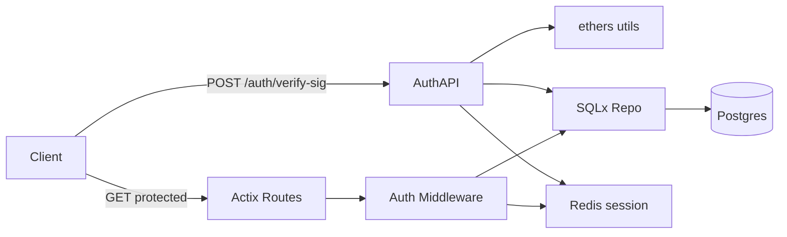
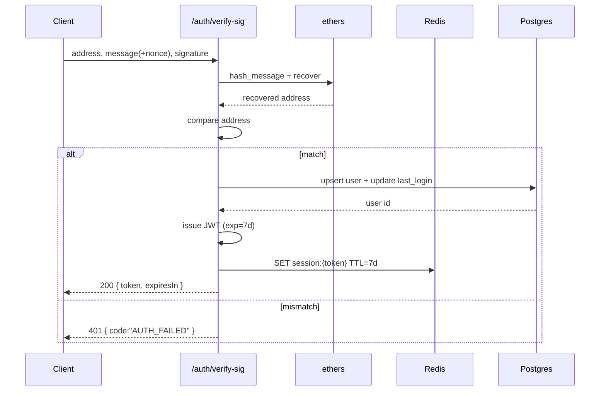

# 后端开发需求分析文档

## 1. 概述
- 本文围绕“认证与 JWT 会话”设计与实现进行全面需求分析，依据文档片段要求：
  - 钱包签名验证（使用 `ethers::utils::hash_message / recover`）
  - 用户入库与登录时间更新
  - JWT 发放（7 天）与校验
  - 写入会话 `session:{token}` 并支持撤销（删除 Redis 会话）
- 目标：提供安全、低延迟的认证通道与可撤销的会话管理，并以中间件保护路由、注入用户上下文。

## 2. 功能需求
### 2.1 核心功能模块
- **签名验证模块**：验证用户钱包签名，恢复地址并与提交地址比对。
- **用户管理模块**：按 `wallet_address` 查询或创建用户，更新 `last_login`。
- **令牌发放模块**：签发 **JWT**（默认 7 天有效），记录到 Redis 会话键。
- **令牌校验模块**：中间件校验 JWT（签名/过期/受众/发行者），并将用户上下文注入请求处理。
- **会话撤销模块**：删除 `session:{token}`，实现服务器侧撤销与登出。

### 2.2 子功能分解
- 签名验证：
  - 使用 `ethers` 的 `hash_message` 对信息进行 EIP-191 兼容哈希；通过 `recover` 自签名中恢复公钥地址。
  - 增加 **挑战/Nonce** 机制（推荐）：后端生成一次性随机 `nonce`（短 TTL），前端对包含该 nonce 的消息签名，后端验证地址与 nonce 新鲜度，防止重放攻击。
- 用户入库与登录：
  - 若不存在则创建，存在则更新 `last_login = NOW()`；记录审计日志。
- JWT 发放：
  - Claims：`sub`（用户ID）、`address`、`iat`、`exp`、`iss`、`aud`、`jti`（随机），可选 `roles`。
  - 有效期：**7 天**（可配置）。
  - 会话写入：`session:{token}` → `{ userId, address }`，TTL 与 JWT 一致。
- 路由保护：
  - 中间件从 `Authorization: Bearer <jwt>` 解析，校验签名与过期；再检查 Redis 会话是否存在（支持撤销）。
  - 注入用户上下文（`UserContext`）到请求链路。
- 会话撤销：
  - 删除 Redis 会话键；后续中间件校验失败返回 **401**。

## 3. 技术架构
- 框架：`Actix-Web`（路由、中间件、异步 I/O）。
- 数据库：`Postgres + SQLx`（用户信息权威存储）。
- 会话存储：`Redis`（`session:{token}`，TTL 与撤销机制）。
- 加密与认证：`jsonwebtoken`（HS256 默认）；`ethers`（签名恢复）。
- 结构图（Mermaid）：



- 数据流程（签名验证）：
  1) 客户端提交 `message + signature (+ nonce)`；
  2) 服务端使用 `ethers` 恢复地址并比对；
  3) 查/建用户并更新登录时间；
  4) 发放 JWT，写入 Redis 会话；
  5) 返回 `token` 与过期信息。

## 4. 接口规范
- 通用：
  - 认证头：`Authorization: Bearer <token>`
  - 响应编码：`application/json`，时间戳为 `epoch millis`（如有）。
  - 错误结构：
    ```json
    { "code": "AUTH_FAILED", "message": "signature mismatch" }
    ```

- POST `/auth/verify-sig`
  - 描述：验证签名并颁发 JWT；将会话写入 Redis。
  - 请求：
    ```json
    {
      "address": "0x...",
      "message": "Login to KMarket: nonce=abcd1234",
      "signature": "0x..."
    }
    ```
  - 响应（成功）：
    ```json
    {
      "token": "<jwt>",
      "expiresIn": 604800,
      "user": { "id": 1, "address": "0x...", "role": "user" }
    }
    ```
  - 响应（失败）：`401`（签名或地址不匹配）、`400`（参数错误）、`500`（内部错误）。

- GET `/auth/me`
  - 描述：校验 JWT 并返回当前用户信息（从 Redis 或 DB）。
  - 响应：
    ```json
    { "id": 1, "address": "0x...", "role": "user", "last_login": 1730875800000 }
    ```

- POST `/auth/logout`
  - 描述：删除 `session:{token}`，使会话立即失效。
  - 响应：`204 No Content`

- 受保护资源示例：
  - GET `/orders/my`（需要中间件注入 `userId`）：返回当前用户订单。

### 代码块示例
- 签名验证（Rust，示例）：
```rust
use ethers::utils::hash_message;
use ethers::types::Signature;

fn verify_signature(address: &str, message: &str, signature_hex: &str) -> anyhow::Result<bool> {
    let msg_hash = hash_message(message);
    let sig = Signature::from_hex(signature_hex)?; // 需引入 hex 解析
    let recovered = sig.recover(msg_hash)?;        // 恢复地址
    Ok(format!("{:?}", recovered).to_lowercase() == address.to_lowercase())
}
```

- JWT 签发（Rust，示例）：
```rust
use jsonwebtoken::{encode, Header, EncodingKey};
use serde::{Serialize, Deserialize};
use chrono::{Utc, Duration};

#[derive(Serialize, Deserialize)]
struct Claims {
    sub: i32,
    address: String,
    iat: usize,
    exp: usize,
    iss: String,
    aud: String,
    jti: String,
    roles: Vec<String>,
}

fn issue_jwt(sub: i32, addr: &str, secret: &str) -> anyhow::Result<String> {
    let now = Utc::now();
    let claims = Claims {
        sub,
        address: addr.to_string(),
        iat: now.timestamp() as usize,
        exp: (now + Duration::days(7)).timestamp() as usize,
        iss: "kmarket".into(),
        aud: "kmarket_users".into(),
        jti: uuid::Uuid::new_v4().to_string(),
        roles: vec!["user".into()],
    };
    Ok(encode(&Header::default(), &claims, &EncodingKey::from_secret(secret.as_ref()))?)
}
```

- Actix 中间件（简化示例）：
```rust
use actix_web::{HttpRequest, HttpResponse, dev::ServiceRequest};
use jsonwebtoken::{decode, DecodingKey, Validation};

async fn auth_middleware(req: ServiceRequest, next: actix_web_lab::middleware::Next<impl actix_web::body::MessageBody>)
    -> Result<actix_web::dev::ServiceResponse, actix_web::Error>
{
    let token = extract_bearer(&req)?; // 从 Authorization 获取
    let secret = std::env::var("JWT_SECRET").unwrap_or_default();
    let data = decode::<Claims>(&token, &DecodingKey::from_secret(secret.as_ref()), &Validation::default())
        .map_err(|_| actix_web::error::ErrorUnauthorized("invalid token"))?;
    // 可选：检查 Redis 是否存在 session:{token}
    // 将用户上下文插入扩展数据
    req.extensions_mut().insert(data.claims);
    next.call(req).await
}
```

### 图表说明
- 验证签名与发放令牌流程：


## 5. 性能指标
- **响应时间**：
  - `/auth/verify-sig`：P50 < **80ms**，P95 < **150ms**（本地链/无外部依赖）。
  - 中间件校验：P50 < **5ms**，P95 < **15ms**（命中 Redis 会话）。
- **吞吐量**：
  - 验证接口 ≥ **500 RPS**；受保护读取 ≥ **1500 RPS**。
- **可用性**：
  - Redis 故障不阻断登录；在撤销场景下优先以 Redis 检查会话存在性，故障时回退到 JWT 仅校验（提醒风险）。
- **资源约束**：
  - 会话键 TTL **7d**，键大小 ≤ **4KB**；避免大 Claims。

## 6. 安全需求
- **签名安全**：
  - 强制 **Nonce 挑战**（短时 TTL）；消息绑定域名与用途，如 `Login to KMarket`；防重放与跨域签名滥用。
  - 比对地址大小写无关；记录签名长度与格式校验。
- **令牌安全**：
  - Claims 需包含 `iss/aud/jti/exp/iat`；配置 **JWT_SECRET**；支持密钥轮换与版本标识。
  - 撤销：删除 `session:{token}`；中间件先检查会话键再验 JWT。
- **授权**：
  - 角色控制（`user/admin`）；管理路由需额外权限检查。
- **数据保护**：
  - 会话仅存必要信息（`userId/address`），禁止存私钥/敏感数据；
  - 传输层 **HTTPS/TLS**；输入参数严格校验；防注入与暴力尝试（速率限制）。
- **审计与监控**：
  - 登录/注销、失败原因与来源 IP 记录；指标包括成功率、延迟、撤销命中率。

## 7. 部署要求
- 环境变量：
  - `JWT_SECRET`、`JWT_ISS`（默认 `kmarket`）、`JWT_AUD`（默认 `kmarket_users`）、`JWT_EXP_DAYS=7`
  - `REDIS_URL=redis://<user>:<pass>@<host>:6379`
- 依赖服务：
  - Redis 与 Postgres 可用；`READYZ_SKIP_PING=true` 测试模式下允许跳过实际连通性。
- 健康检查：
  - `/readyz`：校验 JWT 配置存在；Redis 可 ping（或测试模式跳过）。
- 速率限制：
  - `/auth/verify-sig` 建议设置每 IP/地址限流（如 `actix-governor`），防止暴力验证与资源耗尽。

---

**关键需求点（加粗）总结**：
- **签名验证必须加入 Nonce 挑战**，防止重放攻击。
- **JWT Claims 完整且安全**（含 `iss/aud/jti/exp/iat`），密钥可轮换。
- **Redis 会话用于撤销与 TTL 控制**，中间件优先检查会话键；故障时降级策略明确。
- **所有受保护路由必须经中间件授权**，并注入用户上下文以保证一致性。

> 本规范确保认证通道安全可靠、会话可控可撤销，并为后续管理接口与交易路径提供统一的用户身份上下文。