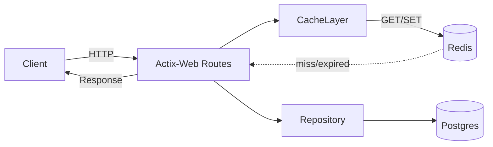
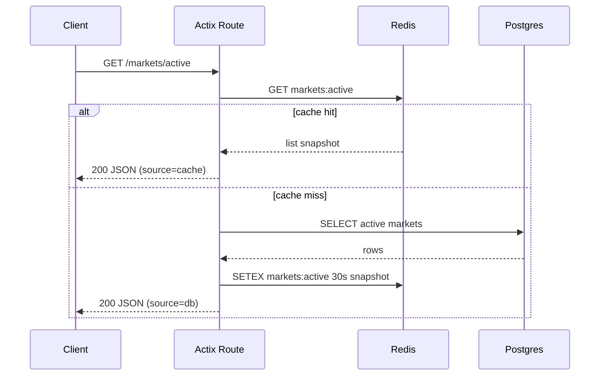

# 后端开发需求分析文档

## 1. 概述
- 本文针对项目后端的 **Redis 缓存与会话** 能力进行需求分析与规范设计，依据文档片段（第 6 节）给出的必做事项与步骤：
  - 建立连接池：`redis::Client` + `aio::ConnectionManager`
  - 键策略与 TTL：
    - `odds:{marketId}` → `{ odds_a, odds_b, timestamp }`，TTL：60s
    - `markets:active` → 列表快照，TTL：30s
    - `session:{token}` → `{ userId, address }`，TTL：7d
- 目标：提升热门读取的响应性能、降低数据库压力、提供稳定的会话管理并在 Redis 故障时 **平稳降级**。

## 2. 功能需求
### 2.1 核心功能模块
- **Redis 连接与资源管理**：统一初始化、连接池化、健康检查与超时控制。
- **缓存策略管理**：按键模型与 TTL 控制，支持命中、过期、失效与重建。
- **会话管理**：登录会话写入、验证、续期与注销（删除）。
- **降级与回退**：Redis 不可用时，读路径回退至数据库或内存默认值；写路径记录告警但不阻塞核心交易。
- **监控与可观测性**：命中率、延迟、错误率、键容量与过期统计。

### 2.2 子功能分解
- 连接管理：
  - 使用 `redis::Client` 创建客户端，`aio::ConnectionManager` 管理异步连接；扩展自定义超时、最大连接数、PING 健康检查。
- 键模型与序列化：
  - `odds:{marketId}`：JSON 序列化（`serde_json`），结构 `{ odds_a: i32, odds_b: i32, timestamp: i64 }`，TTL=60s。
  - `markets:active`：JSON 数组快照（`Vec<MarketSummary>`），TTL=30s。
  - `session:{token}`：JSON 会话 `{ userId: i32, address: String }`，TTL=7d；与 JWT 或签名验证结合。
- 写入策略：
  - 使用 `SETEX`/`PSETEX` 或 `SET` + `EXPIRE`；支持原子写入与覆盖；必要时 `MSET` 批量写入。
- 读取策略：
  - 读缓存 → 命中返回；未命中 → 查询数据库 → 写回缓存（带 TTL）；可设 `forceRefresh` 绕过缓存。
- 失效策略：
  - 市场状态变更（`active → closed/settled`）时主动删除或重建相关键；赔率更新时覆盖旧键。
- 降级策略：
  - Redis 故障或超时：返回数据库结果或空快照；记录指标与日志，不阻塞请求。

## 3. 技术架构
- Web 框架：`Actix-Web`（高性能异步）、路由层调用缓存与仓储（Repository）。
- 数据访问：`SQLx + Postgres` 作为权威数据源；缓存层为读取加速与会话存储。
- Redis 客户端：`redis = { version = "0.24", features = ["tokio-comp"] }`；异步连接管理器：`aio::ConnectionManager`。
- 序列化：`serde_json` 将结构体编码为字符串存储于 Redis。
- 结构图（Mermaid）：



- 数据流（缓存回退）：
  1) 路由读取 → 先查缓存；
  2) 未命中 → 查数据库 → 写回缓存（TTL）→ 返回；
  3) Redis 故障 → 直接查数据库，并记录降级事件与指标。

## 4. 接口规范
- 统一规范：
  - 路径：`/odds/{marketId}`、`/markets/active`、`/session`、`/session/me`、`/session`（DELETE）
  - 返回：`application/json`；时间戳使用 `epoch millis`；状态码：`200/201/204/401/404/500`。
  - 认证：`Authorization: Bearer <token>`。

- 接口定义：
  - GET `/odds/{marketId}`
    - 描述：读取指定市场的赔率；优先走缓存 `odds:{marketId}`。
    - 响应：
      ```json
      {
        "marketId": 1001,
        "odds_a": 185,
        "odds_b": 210,
        "timestamp": 1730875800000,
        "source": "cache|db"
      }
      ```
    - 错误：`404`（市场不存在），`500`（内部错误）。

  - GET `/markets/active`
    - 描述：返回当前活跃市场的列表快照；优先走缓存 `markets:active`。
    - 查询参数：`forceRefresh=true|false`（默认 `false`）。
    - 响应：
      ```json
      [
        { "marketId": 1001, "title": "Game A", "category": "sports" },
        { "marketId": 1002, "title": "Game B", "category": "sports" }
      ]
      ```

  - POST `/session`
    - 描述：创建登录会话并写入 `session:{token}`，TTL=7d。
    - 请求：
      ```json
      { "address": "0x...", "signature": "0x..." }
      ```
    - 响应：
      ```json
      { "token": "<jwt>", "expiresIn": 604800 }
      ```

  - GET `/session/me`
    - 描述：校验 `Authorization`，读取 `session:{token}` 返回会话信息。
    - 响应：
      ```json
      { "userId": 1, "address": "0x..." }
      ```

  - DELETE `/session`
    - 描述：注销当前会话，删除 `session:{token}`。
    - 响应：`204 No Content`

- 统一错误结构：
  ```json
  { "code": "CACHE_MISS", "message": "cache miss, fetched from DB" }
  ```

## 5. 性能指标
- **响应时间**：
  - 缓存命中：P50 < **50ms**，P95 < **100ms**；
  - 未命中回退：P50 < **120ms**，P95 < **250ms**。
- **吞吐量**：
  - `/markets/active` ≥ **1000 RPS**；`/odds/{marketId}` ≥ **1500 RPS**（缓存命中场景）。
- **命中率目标**：
  - `odds` ≥ **80%**；`markets:active` ≥ **90%**。
- **可用性**：
  - Redis 故障时，核心写路径不中断；读路径降级不超过 **5%** 服务错误率。
- **资源限制**：
  - Redis 内存水位告警阈值 **75%**；键 TTL 按需清理；避免大键与巨型 JSON（单键 ≤ **32KB**）。

## 6. 安全需求
- **认证授权**：
  - 会话采用 **JWT** 或签名验证；`session:{token}` 仅存储必要信息（`userId/address`），不存私钥或敏感数据。
  - 路由强制 `Authorization`；管理操作需 **角色授权**（admin）。
- **数据保护**：
  - 会话 TTL **7d**，支持主动注销与服务端撤销；禁止持久化敏感信息。
  - 传输层 **HTTPS/TLS**；输入参数校验与过滤（防注入）。
- **Redis 安全**：
  - 使用鉴权的 `REDIS_URL`；网络隔离；限制危险命令（如 `EVAL`）。
  - 访问控制与速率限制（`actix-governor`）。
- **审计与可观测性**：
  - 记录登录/注销与缓存写入行为；指标上报（命中率、延迟、错误）。

## 7. 部署要求
- 环境变量：
  - `REDIS_URL=redis://<user>:<pass>@<host>:6379`（生产必须鉴权）。
  - `JWT_SECRET`、`READYZ_SKIP_PING`（测试场景可跳过实际 PING）。
- 依赖服务：
  - Redis 7（内存型，非持久化）；生产可选主从或哨兵以提升可用性。
- 健康检查：
  - 启动时 PING；运行态 `/readyz` 若 Redis 不可用则降级但返回 `200` 或 `503` 取决于策略。
- 资源与容器：
  - Docker Compose（开发）：`redis:7` 暴露 `6379`；
  - 生产需配置内存限制、最大连接与慢查询日志。
- 指标与日志：
  - 使用 `tracing` 输出结构化日志；Prometheus/Grafana 采集命中率与延迟。

---

### 代码示例：Redis 连接与读写
```rust
use redis::{Client};
use redis::aio::ConnectionManager;
use serde::{Serialize, Deserialize};
use serde_json;
use std::time::Duration;

#[derive(Serialize, Deserialize)]
struct Odds { odds_a: i32, odds_b: i32, timestamp: i64 }

async fn redis_connect(url: &str) -> anyhow::Result<ConnectionManager> {
    let client = Client::open(url)?;
    let conn = client.get_tokio_connection_manager().await?;
    Ok(conn)
}

async fn get_odds(conn: &mut ConnectionManager, market_id: i64) -> anyhow::Result<Option<Odds>> {
    let key = format!("odds:{}", market_id);
    let val: Option<String> = redis::cmd("GET").arg(&key).query_async(conn).await?;
    Ok(val.map(|s| serde_json::from_str(&s).ok()).flatten())
}

async fn set_odds(conn: &mut ConnectionManager, market_id: i64, odds: &Odds) -> anyhow::Result<()> {
    let key = format!("odds:{}", market_id);
    let payload = serde_json::to_string(odds)?;
    // SETEX key seconds value
    redis::cmd("SETEX").arg(&key).arg(60).arg(payload).query_async(conn).await?;
    Ok(())
}
```

### 代码示例：`markets:active` 与会话
```rust
#[derive(Serialize, Deserialize)]
struct MarketSummary { market_id: i64, title: String, category: String }

#[derive(Serialize, Deserialize)]
struct Session { user_id: i32, address: String }

async fn get_markets_active(conn: &mut ConnectionManager) -> anyhow::Result<Option<Vec<MarketSummary>>> {
    let val: Option<String> = redis::cmd("GET").arg("markets:active").query_async(conn).await?;
    Ok(val.map(|s| serde_json::from_str(&s).ok()).flatten())
}

async fn set_markets_active(conn: &mut ConnectionManager, list: &[MarketSummary]) -> anyhow::Result<()> {
    let payload = serde_json::to_string(list)?;
    redis::cmd("SETEX").arg("markets:active").arg(30).arg(payload).query_async(conn).await?;
    Ok(())
}

async fn create_session(conn: &mut ConnectionManager, token: &str, session: &Session) -> anyhow::Result<()> {
    let key = format!("session:{}", token);
    let payload = serde_json::to_string(session)?;
    redis::cmd("SETEX").arg(&key).arg(7 * 24 * 3600).arg(payload).query_async(conn).await?;
    Ok(())
}

async fn revoke_session(conn: &mut ConnectionManager, token: &str) -> anyhow::Result<()> {
    let key = format!("session:{}", token);
    redis::cmd("DEL").arg(&key).query_async(conn).await?;
    Ok(())
}
```

### 流程图：读取活跃市场（缓存 → 回退 → 写回）


### 伪代码：读缓存与降级策略
```pseudo
function read_with_cache(key, ttl, loader):
  val = redis.GET(key)
  if val != null:
    return parse(val), source="cache"
  try:
    data = loader()  // query DB or external
    redis.SETEX(key, ttl, json(data))
    return data, source="db"
  catch err:
    // Redis DOWN or loader failed
    if loader_success:
      return data, source="db"
    else:
      return default(), source="degraded"
```

---

**关键需求点总结（加粗）**：
- **Redis 必须可替换为降级模式**（故障不影响核心写路径）。
- **键 TTL 固定：odds=60s、markets=30s、session=7d**；支持主动失效。
- **统一序列化为 JSON**，避免跨语言兼容问题。
- **监控命中率、延迟与错误率**，作为验收标准的一部分。
- **会话不存敏感信息**，认证走 JWT/签名，服务端可撤销。

> 完成以上规范后，后端可在不改动数据库模型的情况下，通过缓存加速常用读取与稳定管理用户会话，并满足性能与安全要求。