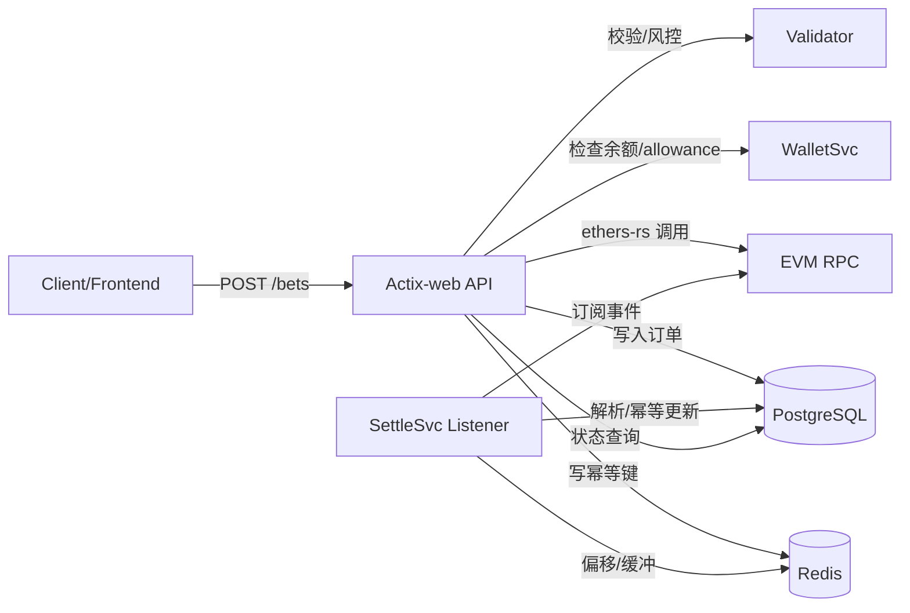
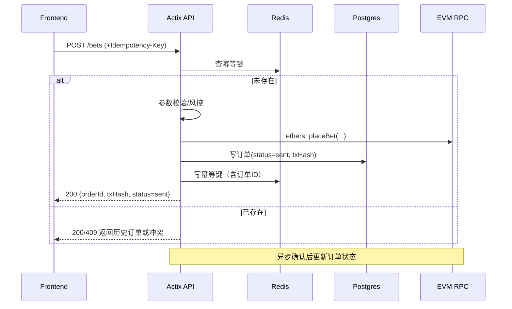
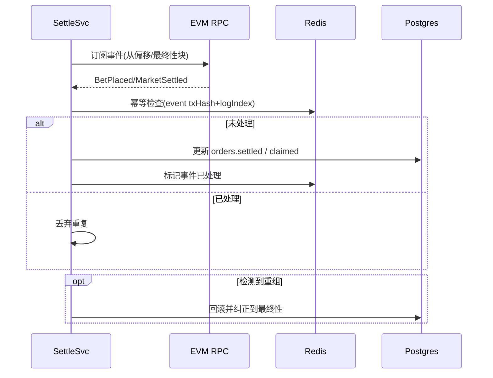
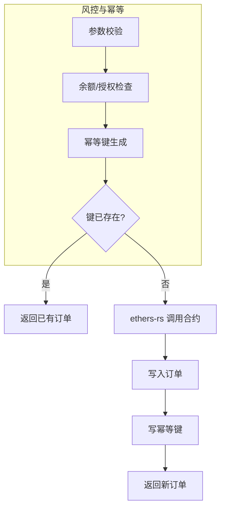
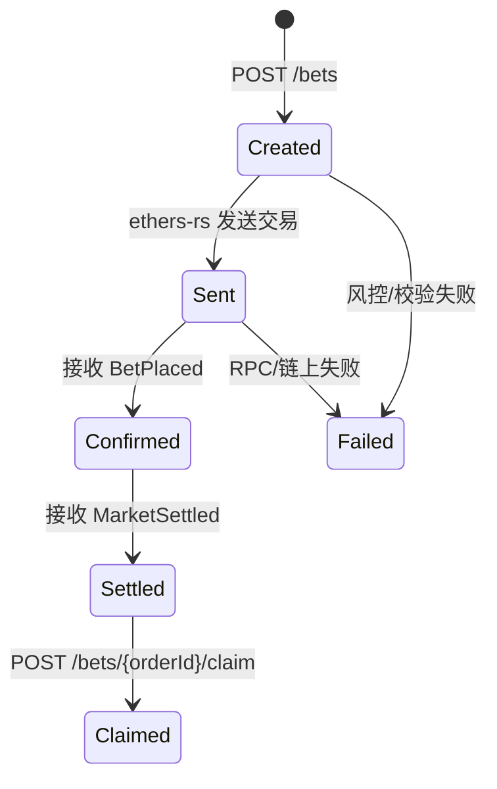

# 后端开发需求分析文档

## 1. 概述
- 基于 `/docs/BACKEND_DEVELOPMENT_STEPS_ACTIX.md#L415-444` 的“投注服务（BettingSvc，链上）”与“结算服务（SettleSvc）”，输出完整需求分析与接口规范，并核对本地数据库表结构。
- 核心目标：
  - 在 `Actix-web` 后端中实现链上下注闭环：参数校验 → 合约调用（`ethers-rs`）→ 入库与幂等 → 回执/异步确认。
  - 实现事件驱动结算闭环：订阅链上事件 → 幂等更新订单状态 → 处理链重组与最终性。
- 验收标准：
  - 从请求到链上回执与入库的闭环完整，错误路径可追踪。
  - 结算状态与链上一致，重复事件不导致状态错乱。

## 2. 功能需求

### 2.1 核心功能模块
- BettingSvc（链上下注）
  - 参数校验与风控（校验 `amount`、`option`、`odds`、`maxSlippage`）。
  - 余额与 `allowance` 检查（ERC-20 授权、余额充足）。
  - 调用合约 `PredictionMarket.placeBet(...)`。
  - 记录 `tx_hash`，等待回执或进行异步确认。
  - 入库 `orders`：初始状态 `settled=false, claimed=false`。
  - 幂等处理：对请求生成幂等键（用户+市场+参数+时间窗），避免重复下单。
  - 失败重试与错误告警：链上失败返回错误并记录原因。
- SettleSvc（事件结算）
  - 订阅并处理链上事件：`MarketSettled`、`BetPlaced` 等。
  - 幂等更新 `orders.settled/claimed`，记录事件版本或事务元数据（`tx_hash`、区块高度）。
  - 处理链重组（reorg）：以区块最终性为准（确认数/Finality），避免状态错乱。
  - 异常处理与重试：事件重复、消息乱序、网络抖动下的可靠更新。
- 支撑模块
  - 认证与授权（JWT/角色）。
  - 幂等键与重试票据存储（Redis/DB）。
  - 日志与审计（请求、交易、事件流水）。
  - 监控与告警（链上调用失败、事件延迟、分叉回滚）。

### 2.2 子功能分解
- BettingSvc
  - 请求入参校验与风控规则：金额范围、赔率与滑点、市场状态。
  - 账户前置检查：ERC-20 `approve` 状态、用户余额。
  - 合约调用与回执处理：签名、发送交易、记录 `tx_hash`、确认策略（同步/异步）。
  - 数据入库：订单记录、初始状态、交易元数据（区块号、链ID）。
  - 幂等保障：生成并校验 `Idempotency-Key`，防止重复下单。
  - 失败路径：错误码、可重试标记、错误原因持久化。
- SettleSvc
  - 事件订阅器：从最新稳定区块或持久化偏移启动。
  - 事件解析与校验：主题匹配、参数解析、签名校验。
  - 幂等更新：根据事件版本与订单状态进行安全更新（去重）。
  - 最终性与回滚：在达到最终性前暂存，发现重组进行纠正。
  - 可重试机制：网络/RPC失败时指数退避重试。
  - 状态查询支持：订单结算状态、可领取状态、事件版本查询。

## 3. 技术架构
- 框架与语言
  - 后端框架：`Actix-web`（Rust）。
  - 链上交互：`ethers-rs`（EVM 兼容链）。
  - 数据访问：异步 SQL（推荐 `sqlx`），结合项目已有迁移。
- 存储与缓存
  - 关系数据库：`PostgreSQL`（订单、事件、审计）。
  - 缓存/队列：`Redis`（幂等键、重试票据、事件偏移、速率限制）。
- 事件处理
  - 事件监听器：独立后台任务/微服务，订阅链上日志。
  - 最终性策略：基于确认数（例如 12 blocks）或共识最终性标识。
- 观测与韧性
  - 日志：`tracing` + 结构化日志。
  - 指标：`Prometheus`（QPS、P95 延迟、事件滞后）。
  - 告警：错误率、链上失败、事件处理积压。

- 架构示意（Mermaid）


- 数据库表（依据项目迁移）
```sql
-- orders
CREATE TABLE IF NOT EXISTS orders (
  id SERIAL PRIMARY KEY,
  order_id BIGINT UNIQUE NOT NULL,
  user_address VARCHAR(42) NOT NULL REFERENCES users(wallet_address),
  market_id BIGINT NOT NULL REFERENCES markets(market_id),
  amount NUMERIC(78,0) NOT NULL,
  odds INTEGER NOT NULL,
  option SMALLINT NOT NULL,
  potential_payout NUMERIC(78,0) DEFAULT NULL,
  settled BOOLEAN NOT NULL DEFAULT false,
  claimed BOOLEAN NOT NULL DEFAULT false,
  tx_hash VARCHAR(66) DEFAULT NULL,
  created_at TIMESTAMP NOT NULL DEFAULT NOW(),
  FOREIGN KEY (market_id, option) REFERENCES market_options(market_id, code)
);
CREATE INDEX IF NOT EXISTS idx_orders_user ON orders(user_address);
CREATE INDEX IF NOT EXISTS idx_orders_market ON orders(market_id);
CREATE INDEX IF NOT EXISTS idx_orders_status ON orders(settled, claimed);

-- chain_events
CREATE TABLE IF NOT EXISTS chain_events (
  id SERIAL PRIMARY KEY,
  event_type VARCHAR(32) NOT NULL,
  tx_hash VARCHAR(66) UNIQUE NOT NULL,
  block_number BIGINT NOT NULL,
  block_timestamp TIMESTAMP NOT NULL,
  market_id BIGINT DEFAULT NULL REFERENCES markets(market_id) ON DELETE SET NULL,
  order_id BIGINT DEFAULT NULL REFERENCES orders(order_id) ON DELETE SET NULL,
  raw JSONB NOT NULL,
  created_at TIMESTAMP NOT NULL DEFAULT NOW()
);
```

## 4. 接口规范
- API 总体规范
  - 前缀：`/api/v1`
  - 认证：`Authorization: Bearer <JWT>`
  - 幂等：使用 `Idempotency-Key` 请求头（或 `POST` 体字段），键值为用户+市场+参数+时间窗生成的散列。
  - 返回统一错误结构，携带 `code`、`message`、`details`。

- `POST /api/v1/bets`
  - 功能：创建链上投注请求，完成参数校验、余额与授权检查、发起合约交易、入库订单。
  - Headers：
    - `Authorization: Bearer <JWT>`
    - `Idempotency-Key: <string>`（强烈建议）
    - `Content-Type: application/json`
  - Request Body（与当前迁移保持一致的字段命名）
```json
{
  "marketId": 123456,
  "option": 1,
  "amount": "1000000000000000000", // 整数精度：NUMERIC(78,0)
  "odds": 185,                        // 整数赔率（例如 1.85 → 185）
  "maxSlippage": "0.02"
}
```
  - Response 200（同步记录，异步链上确认）
```json
{
  "orderId": 987654321,
  "status": "sent",
  "txHash": "0xabc123...",
  "settled": false,
  "claimed": false
}
```
  - 可能错误
    - `400` 参数错误（金额、赔率、滑点不合法）。
    - `401` 未认证。
    - `403` 授权不足。
    - `409` 幂等冲突（同键重复下单）。
    - `422` 余额不足或 `allowance` 未授权。
    - `500` 链上调用失败（附带原因）。

- `GET /api/v1/bets/{orderId}`
  - 功能：查询订单与链上状态。
  - Response 200
```json
{
  "orderId": 987654321,
  "status": "confirmed",
  "txHash": "0xabc123...",
  "blockNumber": 19876543,
  "settled": false,
  "claimed": false
}
```

- `GET /api/v1/bets?userAddress={0x..}&marketId={id}&status=pending|confirmed|failed`
  - 功能：订单列表查询，支持分页与筛选。

- `POST /api/v1/bets/{orderId}/claim`
  - 功能：领取结算收益（若合约支持），可能由 SettleSvc 判定 `claimed` 条件后触发。
  - 错误：重复领取返回 `409` 或 `400`。

- 投注时序（Mermaid）


- 结算时序（Mermaid）


## 5. 性能指标
- 投注接口（`POST /bets`）
  - 响应时间（不含链上最终确认，仅前置校验与交易发送）：
    - P95 ≤ **250ms**，P99 ≤ **400ms**。
  - 吞吐量：单实例 **≥ 800 req/min**（取决于 RPC 与签名开销）。
  - 幂等检查开销：Redis 命中 **≤ 5ms**（本地网络）。
- 结算服务（事件处理）
  - 事件延迟：从事件产生到订单状态更新 **≤ 5s**。
  - 最终性策略：确认数 **≥ 12 blocks**（可配置）。
  - 重试策略：指数退避，最大重试窗口 **≤ 2min**。
- 可靠性指标
  - 幂等冲突率 **≈ 0%**。
  - 事件重复处理率 **≈ 0%**。

## 6. 安全需求
- 认证与授权
  - 使用 **JWT**（`Authorization: Bearer`），校验用户身份与角色。
- 请求安全
  - **幂等键** 强制使用（下注场景），防止重复提交与重放。
  - **速率限制** 与 **IP 限流**（Redis 令牌桶）。
  - 参数校验与风控：金额上下限、市场状态检查、**滑点控制**。
- 数据保护
  - 数据库凭据与密钥放入环境变量与密钥管理。
  - 交易私钥仅在安全容器中使用，签名前后有审计日志。
  - 敏感日志脱敏（不泄露私钥、令牌、完整地址）。
- 链上一致性
  - **最终性策略**：达到最终性后才持久化结算状态。
  - **重组处理**：分叉时回滚订单状态，保证与链上一致。
- 审计与可追踪
  - 全链路日志：请求 ID、`Idempotency-Key`、`tx_hash`。
  - 错误路径可追踪（失败原因持久化、重试次数记录）。

## 7. 部署要求
- 运行环境
  - Docker 化部署（已提供 `Dockerfile`、`docker-compose.yml`）。
  - 环境变量：`DATABASE_URL`、`REDIS_URL`、`JWT_SECRET`、`RPC_ENDPOINT`、`CHAIN_ID`、`CONFIRMATIONS` 等。
- 服务拓扑
  - `Actix API` 与 `SettleSvc Listener` 可分为两个容器。
  - 反向代理（Nginx/Traefik）与 TLS 终止，启用 HTTP/2。
- 启动顺序与初始化
  - 先迁移数据库（`migrations`），再启动 API 与 Listener。
  - Listener 从持久化偏移或稳定块开始订阅，避免重复。
- 可观测性与告警
  - 暴露健康检查与指标端点（`/health`, `/metrics`）。
  - 告警项：RPC 不可达、事件积压、数据库/Redis 不可用、错误率上升。
- 灰度与回滚
  - 蓝绿/滚动发布；链上异常时可快速回滚到上一个版本。

---

### 附录：本地数据库结构校验结果
> 目标：查看本地数据库是否已存在相关表，并且结构与迁移一致。

- 连接方式
  - 使用临时容器客户端：`docker run --rm -e PGPASSWORD=55258864 postgres:15 psql -h host.docker.internal -U postgres -d kmarket_db`。
  - 依据 `.env.example`，本地 Postgres 口令为 `55258864`，端口 `5432`。

- 表存在性（结果）
```text
List of relations
 Schema |       Name       | Type  |  Owner
--------+------------------+-------+----------
 public | _sqlx_migrations | table | postgres
 public | admin_actions    | table | postgres
 public | chain_events     | table | postgres
 public | market_options   | table | postgres
 public | markets          | table | postgres
 public | order_claims     | table | postgres
 public | orders           | table | postgres
 public | users            | table | postgres
```
- `orders` 列定义（信息模式查询）
```text
column_name        | data_type                     | is_nullable | column_default
-------------------+-------------------------------+-------------+------------------------------------
id                 | integer                       | NO          | nextval('orders_id_seq'::regclass)
order_id           | bigint                        | NO          |
user_address       | character varying             | NO          |
market_id          | bigint                        | NO          |
amount             | numeric                       | NO          |
odds               | integer                       | NO          |
option             | smallint                      | NO          |
potential_payout   | numeric                       | YES         | NULL::numeric
settled            | boolean                       | NO          | false
claimed            | boolean                       | NO          | false
tx_hash            | character varying             | YES         | NULL::character varying
created_at         | timestamp without time zone   | NO          | now()
```
- `orders` 索引与约束
```text
INDEXES:
orders_pkey (PRIMARY KEY id)
orders_order_id_key (UNIQUE order_id)
idx_orders_user (user_address)
idx_orders_market (market_id)
idx_orders_status (settled, claimed)

CONSTRAINTS:
FOREIGN KEY (user_address) REFERENCES users(wallet_address)
FOREIGN KEY (market_id) REFERENCES markets(market_id)
FOREIGN KEY (market_id, option) REFERENCES market_options(market_id, code)
```
- `chain_events` 列与约束
```text
COLUMNS:
id, event_type, tx_hash (UNIQUE), block_number, block_timestamp,
market_id (nullable, FK markets.market_id ON DELETE SET NULL),
order_id (nullable, FK orders.order_id ON DELETE SET NULL),
raw JSONB, created_at

CONSTRAINTS:
PRIMARY KEY (id)
UNIQUE (tx_hash)
FK (market_id) -> markets(market_id) ON DELETE SET NULL
FK (order_id) -> orders(order_id) ON DELETE SET NULL
```
- 一致性结论
  - `orders`、`chain_events` 两张表在本地数据库均已存在，字段、索引与外键约束与项目迁移脚本保持一致。
  - 与本文档早前的示例方案相比，存在如下差异：
    - **odds 为 INTEGER**（示例中为小数），项目采用整数赔率以减少浮点误差。
    - **amount 为 NUMERIC(78,0)**（示例中为高精小数），项目统一使用整数最小单位计量。
    - **order_id BIGINT 唯一键**（示例采用 UUID），项目采用数值型订单号。
    - **users 关联字段为 wallet_address**（而非用户 UUID）。

- 建议
  - 前后端接口层应根据现有迁移字段命名与类型进行对齐（例如 `odds` 整数化、`option` 使用 `SMALLINT`）。
  - 若需要小数赔率/金额表示，建议在接口层做转换（如 `1.85 → 185`）。

---

```rust
// 处理器示例（字段对齐当前迁移）
#[post("/api/v1/bets")]
async fn post_bets(
    auth: AuthContext,
    headers: HttpRequest,
    payload: web::Json<PostBetReq>,
    db: DbPool,
    redis: RedisClient,
    chain: EthersClient,
) -> impl Responder {
    let idem_key = headers
        .headers()
        .get("Idempotency-Key")
        .and_then(|v| v.to_str().ok());

    if let Some(key) = idem_key {
        if let Some(existing) = redis.get_order_by_idem(key).await? {
            return HttpResponse::Ok().json(existing);
        }
    }

    validate_payload(&payload)?;                // 参数校验/风控
    check_allowance_and_balance(&auth, &payload, &chain).await?; // 余额+授权

    let tx = chain.place_bet(&auth.wallet, &payload).await?;     // ethers-rs 调用
    let order = insert_order(&db, &auth.user_address, &payload, &tx).await?;

    if let Some(key) = idem_key {
        redis.save_idem_key(key, &order).await?;
    }

    Ok(HttpResponse::Ok().json(order))
}
```



## 8. 术语与定义
- `market_id`：市场唯一标识（`BIGINT`）。
- `option`：下注选项编码（`SMALLINT`，例如 `1=home`, `2=away`）。
- `odds`：整数化赔率，`1.85` 表示为 `185`（避免浮点误差）。
- `amount`：下注金额，使用最小单位整数，`NUMERIC(78,0)`，API 传输为字符串。
- `order_id`：订单号（`BIGINT` 唯一）。
- `user_address`：用户钱包地址（字符串，`0x...`）。
- `settled/claimed`：结算完成/已领取收益标志（布尔）。
- `finality`：区块达到最终性（例如 12 确认）。
- `reorg`：链重组导致区块回滚，需要纠正订单状态。

## 9. 错误处理与边界条件
- 统一错误格式（公共接口）：
```json
{ "code": 400, "error": "bad request: <details>" }
```
- 错误码分类
  - 400 BadRequest：参数非法、风控拒绝、赔率/滑点不符合。
  - 401 Unauthorized：未认证或令牌无效。
  - 403 Forbidden：权限不足（例如非 admin 访问管理端）。
  - 409 Conflict：幂等冲突、重复领取。
  - 422 UnprocessableEntity：余额不足、`allowance` 未授权、链上前置校验失败。
  - 429 TooManyRequests：限流触发（含重试头部）。
  - 500 Internal：链上调用失败、内部错误（记录原因与 traceId）。
  - 503 ServiceUnavailable：资源未配置或依赖不可用（DB/Redis/RPC）。

- 边界条件说明
  - 链重组（reorg）：在未达最终性前，对事件更新设置暂存；达到最终性后确认；检测到回滚时撤销更新。
  - 重复事件：按 `(tx_hash, log_index)` 去重；重复事件直接丢弃。
  - 乱序消息：以区块号与日志序号排序处理，维护偏移游标与版本号。
  - 批量失败重试：指数退避（50ms→100ms→200ms→...，最大 2min），记录重试次数与最终状态。
  - 余额或 `allowance` 变化：下注前读取最新状态；若发送后失败，返回可重试错误。
  - 赔率变化与滑点控制：若链上成交赔率超出 `maxSlippage`，拒绝或回滚订单（以合约实现为准）。
  - 幂等窗口：建议 60s；超出窗口后视为新请求。

### 9.1 幂等键生成与校验
- 算法（示例）：`idempotency_key = SHA256(user_address || market_id || option || amount || odds || time_window_bucket)`；`time_window_bucket = floor(now_ms / 60000)`（1 分钟窗口）。
- 存储：`Redis SETNX idemp:<key> <order_id> EX 60`，若存在则返回历史订单或 `409`。
- 重试：客户端在网络错误或可重试错误时重放请求，必须复用同一幂等键。

## 10. 测试用例与验收标准
- 单元测试（示例）
  - 参数校验：非法 `amount/odds/option/maxSlippage` 返回 400。
  - 幂等：相同幂等键并发请求仅写入一次订单；其余返回历史订单或 409。
  - 余额与授权检查：模拟不足余额与未授权，返回 422。
  - 链上调用失败：模拟 RPC 错误返回 500，并持久化错误原因。

- 集成测试（示例）
  - `POST /bets` → 返回 `orderId/txHash`；随后事件监听更新 `settled/claimed`。
  - 事件重复与乱序：构造多次 `BetPlaced/MarketSettled`，验证幂等更新不紊乱。
  - 重组场景：模拟回滚与最终性确认，验证状态纠正。
  - 限流：并发压测触发 `429`，校验重试头部与恢复后吞吐。

- 验收标准（扩展）
  - 从请求到链上回执与入库闭环完整；错误路径可追踪（含 traceId）。
  - 结算状态与链上一致；重复事件不导致状态错乱；最终性策略生效。
  - P95 响应时间与吞吐满足指标；事件延迟 ≤ 5s；积压有告警与自恢复策略。
  - 安全：JWT 校验，CORS 受限，限流有效，敏感信息不泄露。

## 11. 可视化说明
- 订单状态机（Mermaid）


## 12. 版本控制与变更记录
- 版本机制：语义化版本（SemVer）
  - 文档版本与接口协议版本分离：例如文档 `v1.1.0`，接口协议 `v1`。
  - 重大变更（Breaking）需提升主版本并在变更记录标注迁移指南。

- 变更记录
| 日期 | 版本 | 变更内容 |
|------|------|----------|
| 2025-11-06 | v1.1.0 | 新增术语定义、错误与边界条件、测试与验收、状态机与版本记录；补充 JSON Schema 与限流说明；对齐现有代码库数据结构。 |
| 2025-11-05 | v1.0.0 | 初始文档：概述/功能/架构/接口/性能/安全/部署与数据库校验。 |

---

### 附录：接口响应与分页约定
- 错误响应（公共接口）：`{ code: number, error: string }`
- 分页：`GET /bets` 支持 `page/pageSize/sortBy/order`；返回 `{ page, pageSize, total, items }`。