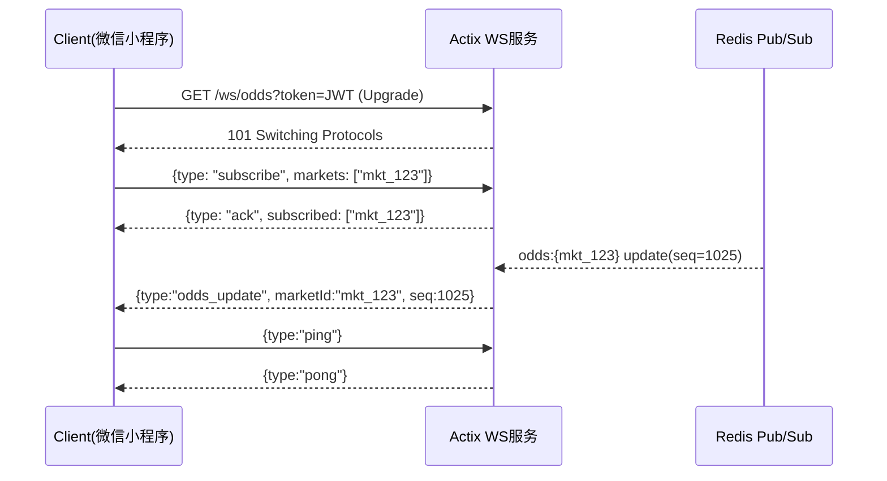

# 后端开发需求分析文档

## 1. 概述
- 本文围绕 `/docs/BACKEND_DEVELOPMENT_STEPS_ACTIX.md` 第 10 节“WebSocket 实时推送”进行系统化需求分析与规范设计。
- 目标：在 Actix（Rust）后端中，基于 `actix-web` + `actix_ws` 实现市场赔率与状态的实时推送，支持按 `marketId` 订阅、心跳与断线重连、弱网环境下的可靠有序消息传输。
- 客户端以微信小程序为主（`wx.connectSocket`），需确保后台挂起/网络波动/断线重连场景下的消息一致性与顺序性。
- 验收重点：在 50–500ms 延迟条件下，消息可靠送达且不乱序（需携带单调递增版本号 `seq` 与时间戳 `ts`）。

## 2. 功能需求

### 2.1 核心功能模块
- 握手与会话管理
  - 路径：`/ws/odds`，完成协议升级、鉴权和会话建立；为每个连接创建独立会话。
- 订阅管理（房间/主题）
  - 按 `marketId` 进行订阅与取消订阅；支持多市场并发订阅；维护连接到房间的路由表。
- 心跳与断线重连
  - 定时 `ping`，超时自动断开；客户端重连后可通过 `resume` 携带各 `marketId` 的 `last_seq` 以状态恢复。
- 广播推送
  - 当 `odds:{marketId}` 更新时，向该房间的订阅者广播；每连接独立发送队列，避免慢消费者阻塞。
- 消息顺序与幂等
  - 每个 `marketId` 维护单调递增 `seq` 与 `ts`；客户端按序处理，乱序/丢序触发补偿或快照。
- 快照与补偿
  - 提供 REST 快照接口与增量补发（基于 `since_seq`），确保状态可恢复。
- 同步一致性检测
  - 前端显示与后端数据一致性校验，偏差时自动触发快照重同步。
- 监控与可观测性
  - 连接数、广播延迟、丢包率、重传次数、心跳超时等指标采集与告警。

### 2.2 子功能分解
- 认证与授权
  - 握手时校验 **JWT**；判定订阅权限与可访问资源范围（`scopeMarkets`）。
- 订阅协议
  - 消息类型：`subscribe`、`unsubscribe`、`resume`、`ping/pong`、`odds_update`、`snapshot`、`error`、`ack`。
- 版本控制与乱序防护
  - 按 `marketId` 维护 `seq`；服务器保证同一 `marketId` 内消息严格有序推送；客户端丢序时触发补偿。
- 断线重连与状态恢复
  - 客户端重连后发送 `resume`（携带每个 `marketId` 的 `last_seq`）；服务端补发缺失消息或下发快照。
- 弱网适配
  - 动态心跳间隔、超时重试、消息队列压力控制、限速与降级策略（慢消费者切换为快照）。
- 多租户与隔离
  - 通过 `tenantId`/`userId`/`scope` 控制可订阅市场范围，防越权订阅。
- 安全防护
  - 输入校验、消息体大小限制、频率限制、DoS 防护、审计日志。

## 3. 技术架构
- 框架与组件
  - Web 框架：`actix-web`；WebSocket：`actix_ws`（或 `actix-web-actors`）。
  - 运行时：`tokio`；反向代理：Nginx（WebSocket Upgrade、TLS）。
  - 缓存与消息总线：Redis（Pub/Sub）或内部事件总线；可选 NATS。
  - 数据库：PostgreSQL（市场数据、历史赔率、更新序号持久化）。
  - 监控：Prometheus + Grafana；日志：JSON 结构化输出。
- 关键数据模型（建议）
  - `markets(market_id, status, metadata)`
  - `odds_updates(id, market_id, seq, ts, odds_payload jsonb, source)`
  - `ws_sessions(session_id, user_id, connected_at, last_seen, subscribed_market_ids jsonb)`
- 广播与顺序
  - 为每个 `marketId` 维护递增 `seq`；更新事件序列化后通过总线分发到 WS 广播层；同一市场内保证严格有序。
- 快照与增量
  - REST 提供 `snapshot`（最新状态）与 `updates`（基于 `since_seq` 的增量），支持重连恢复。

```mermaid
flowchart LR
  A[更新源: 交易/风控] --> B[序列化与编号 seq]
  B --> C{事件总线: Redis Pub/Sub}
  C -->|odds:{marketId}| D[WebSocket 广播服务]
  D -->|房间推送| E[客户端: 微信小程序]
  E --> F[按 seq 应用更新]
  E -->|缺失或乱序| G[请求快照/补发]
```

## 4. 接口规范
- WebSocket 握手
  - 路径：`GET /ws/odds?token=<JWT>`
  - 请求头：`Upgrade: websocket`，可附加 `Sec-WebSocket-Protocol`
  - 鉴权：`token`（JWT，短期、携带可订阅市场范围），校验成功后建立会话。

- WebSocket 消息协议（JSON）
  - 入站（客户端→服务端）
    - `subscribe`：
      ```json
      { "type": "subscribe", "markets": ["mkt_123","mkt_456"] }
      ```
    - `unsubscribe`：
      ```json
      { "type": "unsubscribe", "markets": ["mkt_456"] }
      ```
    - `resume`：
      ```json
      {
        "type": "resume",
        "offsets": { "mkt_123": 1024, "mkt_456": 88 }
      }
      ```
    - `ping`：
      ```json
      { "type": "ping", "ts": 1710001112223 }
      ```
  - 出站（服务端→客户端）
    - `ack`：
      ```json
      { "type": "ack", "ok": true, "subscribed": ["mkt_123"] }
      ```
    - `pong`：
      ```json
      { "type": "pong", "ts": 1710001112223 }
      ```
    - `odds_update`：
      ```json
      {
        "type": "odds_update",
        "marketId": "mkt_123",
        "seq": 1025,
        "ts": 1710001113000,
        "version": "v1",
        "payload": { "odds": { "home": 1.85, "away": 2.1 } }
      }
      ```
    - `snapshot`：
      ```json
      {
        "type": "snapshot",
        "marketId": "mkt_123",
        "seq": 1025,
        "ts": 1710001113000,
        "payload": { "odds": { "home": 1.85, "away": 2.1 }, "status": "OPEN" }
      }
      ```
    - `error`：
      ```json
      { "type": "error", "code": "UNAUTHORIZED", "message": "invalid token" }
      ```

- REST API（配套快照与令牌）
  - `POST /api/ws/token`（颁发短期 JWT）
    - 请求：
      ```json
      { "userId": "u_789", "scopeMarkets": ["mkt_123","mkt_456"], "ttlSeconds": 600 }
      ```
    - 响应：
      ```json
      { "token": "jwt-token-string", "expiresAt": "2025-11-06T12:00:00Z" }
      ```
  - `GET /api/markets/{marketId}/odds/snapshot`
    - 响应：
      ```json
      { "marketId":"mkt_123","seq":1025,"ts":1710001113000,"odds":{"home":1.85,"away":2.1},"status":"OPEN" }
      ```
  - `GET /api/markets/{marketId}/odds/updates?since_seq=1000&limit=200`
    - 响应：
      ```json
      {
        "marketId":"mkt_123",
        "fromSeq":1000,
        "toSeq":1025,
        "updates":[ /* array of odds_update */ ]
      }
      ```
  - `GET /api/ws/health`
    - 响应：
      ```json
      { "uptimeSec": 3600, "connections": 1245, "broadcastLatencyMsP95": 180 }
      ```

- 错误码约定（示例）
  - `UNAUTHORIZED`、`FORBIDDEN`、`INVALID_REQUEST`、`RATE_LIMITED`、`INTERNAL_ERROR`、`ROOM_NOT_FOUND`



- 反向代理示例（Nginx）：
```nginx
server {
  listen 443 ssl;
  server_name api.example.com;

  ssl_certificate     /etc/ssl/fullchain.pem;
  ssl_certificate_key /etc/ssl/privkey.pem;

  location /ws/odds {
    proxy_http_version 1.1;
    proxy_set_header Upgrade $http_upgrade;
    proxy_set_header Connection "upgrade";
    proxy_set_header Host $host;
    proxy_read_timeout 600s;
    proxy_pass http://backend:8080;
  }
}
```

## 5. 性能指标
- 延迟与顺序
  - 握手响应时间：P95 ≤ 200ms（本地+代理）。
  - 广播端到端延迟：P95 ≤ 300ms；**弱网（50–500ms）下不乱序**（按 `seq` 校验）。
  - 同一 `marketId` 内保证严格递增序；跨市场不强制统一序。
- 吞吐与并发
  - 并发连接数目标：≥ 10,000（单实例）；可水平扩展。
  - 广播吞吐：≥ 1,000 msg/s（单实例）稳定无丢包。
- 可靠性与稳定性
  - 丢包率：≤ 0.1%（按连接统计）；补偿成功率 ≥ 99.9%。
  - 心跳超时误杀率：≤ 0.05%；重连平均耗时 ≤ 2s。
- 资源占用（参考）
  - 单连接内存：≤ 64KB（含订阅、缓冲）；CPU 利用率 P95 ≤ 70%。

## 6. 安全需求
- 认证授权
  - 握手使用短期 **JWT**；含 `sub`（userId）、`scope`（可订阅市场集合）、`exp`；服务端校验签名与有效期。
- 传输与数据保护
  - 强制 **TLS**；限制消息大小（如 ≤ 32KB），防止资源滥用；可选对 `payload` 做 HMAC 完整性校验。
- 访问控制与防滥用
  - **频率限制**：订阅/取消订阅/恢复请求限速；广播速率与连接速率限流。
  - 黑白名单与 IP/UA 检测；异常行为审计（含订阅异常、心跳异常）。
- 输入校验与错误处理
  - JSON 结构验证；安全退出（连接关闭时清理订阅）。
  - 错误码规范统一；避免信息泄露（不暴露内部实现细节）。

## 7. 部署要求
- 拓扑与网关
  - Nginx 反向代理（`upgrade` 支持、`proxy_read_timeout` ≥ 60s、`keepalive`）。
  - 粘性会话（若订阅状态存内存）；或使用 Redis/NATS 共享订阅状态实现无粘性。
- 伸缩与高可用
  - 多实例水平扩展；滚动发布前**优雅关闭**（`drain` 连接），避免中断；健康检查 `/api/ws/health`。
- 配置与环境
  - 环境变量：`JWT_SECRET`, `REDIS_URI`, `DB_URI`, `WS_PING_INTERVAL_MS`, `WS_TIMEOUT_MS`。
  - 日志：结构化 JSON，包含 `session_id`、`market_id`、`seq`、延迟指标。
- 监控与告警
  - Prometheus 指标暴露：连接数、广播延迟、每市场消息速率、心跳超时数；异常行为（速率、错误码激增、重传失败）触发告警。

---

示例代码（Actix WebSocket 会话简化示例）：
```rust
use actix_web::{get, web, HttpRequest, HttpResponse};
use actix_ws::{Message, Session};
use futures_util::StreamExt;
use serde::Deserialize;

#[derive(Deserialize)]
struct WsQuery { token: String }

#[get("/ws/odds")]
async fn ws_odds(req: HttpRequest, query: web::Query<WsQuery>) -> HttpResponse {
    // 1) 校验 JWT（省略） -> user_id, scope_markets
    let (response, mut session, mut msg_stream) = match actix_ws::handle(&req) {
        Ok(parts) => parts,
        Err(_) => return HttpResponse::Unauthorized().finish(),
    };

    actix_web::rt::spawn(async move {
        // 心跳与订阅管理（示例）
        let ping_interval = std::time::Duration::from_secs(15);
        let mut interval = actix_web::rt::time::interval(ping_interval);

        loop {
            tokio::select! {
                _ = interval.tick() => {
                    if session.ping(b"ping").await.is_err() { break; }
                }
                Some(Ok(msg)) = msg_stream.next() => {
                    match msg {
                        Message::Text(text) => {
                            // 解析 subscribe/unsubscribe/resume
                            // 根据 marketId 管理房间与补发逻辑（省略）
                        }
                        Message::Close(_) => break,
                        _ => {}
                    }
                }
                else => break,
            }
        }
    });

    response
}
```

广播与顺序控制（伪代码）：
```pseudo
onOddsUpdate(marketId, payload):
  seq := nextSeq(marketId)          // 单调递增
  ts  := now()
  msg := { type:"odds_update", marketId, seq, ts, payload }
  persistUpdate(marketId, seq, payload, ts)  // 可选持久化
  for session in room(marketId):
    enqueue(session, msg)            // 每连接独立队列
    flush(session)                   // 避免阻塞；超压则降级或触发快照
```

断线重连与补偿（伪代码）：
```pseudo
onResume(session, offsets):
  for (marketId, lastSeq) in offsets:
    latest := latestSeq(marketId)
    if lastSeq < latest:
      updates := fetchUpdates(marketId, since=lastSeq)
      if len(updates) > MAX_DIFF or updates_missing:
        snapshot := fetchSnapshot(marketId)
        send(session, snapshot)
      else:
        for u in updates:
          send(session, u)
```

```mermaid
flowchart TD
  S[客户端重连成功] --> R[发送 resume: {marketId: last_seq}]
  R --> J{last_seq < latest_seq?}
  J -- 否 --> A[ACK，无需补偿]
  J -- 是 --> K{差异量>阈值?}
  K -- 是 --> SN[下发 snapshot]
  K -- 否 --> UP[补发 updates]
  SN --> A
  UP --> A
```

关键需求点（加粗）：
- **握手必须鉴权**：`/ws/odds?token=JWT`
- **按 marketId 订阅房间**：`subscribe/unsubscribe`
- **心跳与断线重连**：定时 `ping`，无响应断开；支持 `resume`
- **广播有序**：同一市场内严格递增 `seq`；乱序自动补偿或快照
- **弱网可靠**：50–500ms 延迟下消息可靠不乱序（带版本/时间戳）