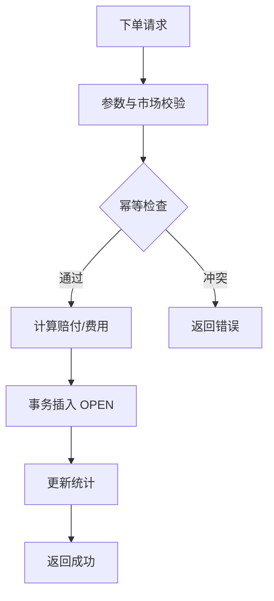
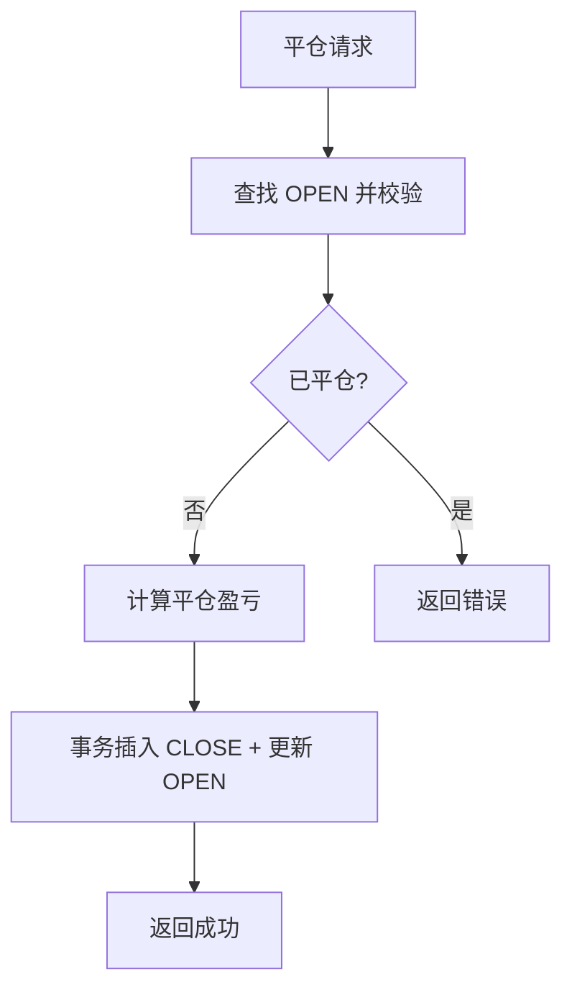

# Sports Betting 开仓/平仓开发文档

本文档详述“下单（Place Bet）”与“平仓（Close Position）”的业务规则、接口契约、计算公式、并发幂等、错误处理、审计与测试方案，并补充微信小程序弱网与同步策略。结合现有代码（`app/api/positions`, `app/api/positions/close`, `app/api/bets`, `lib/event-listener.ts`，以及数据库实际结构）编写。

## 1. 概览
- 目标：保证开仓与平仓的端到端准确性（链上事件 → 服务端 → 数据库 → 前端展示），并确保在弱网和并发场景下的正确性与幂等。
- 范围：接口与数据模型、风控与计算、幂等与事务、日志与审计、同步与重试、测试与运维。

## 2. 数据模型

### 2.1 users
- 关键字段：`id`, `wallet_address`, `username`。
- 作用：通过 `user_id` 与 `positions` 联表，获取用户钱包地址与名称。

### 2.2 markets
- 关键字段：`id`, `title`, `description`, `end_date`, `status`。
- 状态（示例）：`1=Open`, `2=Closed`, `3=Resolved`, `4=Canceled`。

### 2.3 positions（核心）
- 关键字段：
  - 标识：`id`, `user_id`, `wallet_address?`, `market_id`, `market_address?`。
  - 类型与状态：`position_type`（`OPEN`/`CLOSE`），`status`（`Placed=1`, `ClosedEarly=6`, 其他见枚举）。
  - 交易参数：`selected_team`, `amount`, `multiplier_bps`。
  - 赔率与结果：`odds_home_bps?`, `odds_away_bps?`, `payout_expected?`, `pnl?`, `fee_paid?`, `close_price?`, `close_pnl?`。
  - 链上关联：`transaction_signature`，`timestamp`，`created_at`, `updated_at`, `closed_at?`。
- 索引与约束建议：
  - `UNIQUE(transaction_signature)` 保证链上事件幂等。
  - `INDEX(user_id, market_id, position_type, status)` 加速查询。

### 2.4 market_stats（可选）
- 聚合：`total_positions`, `total_volume_lamports`, `active_positions`, `avg_position_size`, `current_odds_home_bps`, `current_odds_away_bps`。
- 更新：触发器或服务端在交易落库后更新（`schema.sql` 中有触发器声明，需确认实现）。

## 3. 接口设计

### 3.1 POST `/api/positions`（开仓）
- 入参：
```json
{
  "wallet_address": "string",
  "market_address": "string",
  "selected_team": 1, // 1=HOME, 2=AWAY
  "amount": 1000000,   // lamports 或最小单位
  "multiplier_bps": 15000,
  "odds_home_bps": 12000, // 可选，取决于 selected_team
  "odds_away_bps": null,
  "payout_expected": 1800000, // 可选，服务端可重算
  "transaction_signature": "solana_tx_sig",
  "client_order_id": "optional-idempotency"
}
```
- 校验：
  - 市场必须 `status=Open` 且未过 `end_date`。
  - 金额、杠杆与赔率在合法范围；风险限额（单笔/日累计/账户总暴露）。
  - 幂等：`transaction_signature` 未使用；如提供 `client_order_id` 则唯一。
- 计算：
  - `odds = selected_team == 1 ? odds_home_bps/10000 : odds_away_bps/10000`
  - `multiplier = multiplier_bps/10000`
  - `payout_expected = amount * odds * multiplier`
  - `fee_open = amount * fee_rate_open`（如需）
- 事务：插入 `positions` 一条 `OPEN`（`status=Placed`）；更新聚合统计。
- 返回：`{ ok: true, position_id, payout_expected, fee_paid?, timestamp }`
- 错误：`400/404/409/422/500`（统一错误体见第 6 节）。

### 3.2 POST `/api/positions/close`（平仓）
- 入参：
```json
{
  "position_id": 123,
  "wallet_address": "string",
  "close_price": 11000, // bps，可选（服务端可按最新赔率计算）
  "close_pnl": 50000,   // 可选，推荐服务端计算
  "transaction_signature": "solana_tx_sig"
}
```
- 校验：
  - 存在对应 `OPEN` 记录且 `status=Placed`；市场仍 `Open`。
  - 幂等：该 `OPEN` 未被平仓；签名未重复。
- 计算（推荐服务端）：
  - `open_price = odds_home_bps or odds_away_bps`（取决于 `selected_team`）
  - `multiplier = multiplier_bps/10000`
  - `close_pnl = amount * ((close_price - open_price)/10000) * multiplier - fee_close`
- 事务：插入 `CLOSE` 记录（`status=ClosedEarly`），并将原 `OPEN` 标记为已平仓，写入 `closed_at`。
- 返回：`{ ok: true, close_position_id, original_position_id, close_pnl, closed_at }`

### 3.3 GET `/api/bets`
- 查询：`wallet_address` 必填；`fixture_id` 映射为 `markets.title LIKE ?`（因无 `fixture_id` 列）。
- 返回：分页投注列表，包含用户与市场简要信息；已修复列名对齐。

## 4. 风控与校验
- 市场状态：`Open` 才可开/平仓；`Closed/Resolved/Canceled` 拒绝。
- 时间：当前时间不得超过 `end_date`（比赛开始/封盘）。
- 金额与杠杆：最小/最大限额，账户风险暴露与每日累计。
- 滑点：`|close_price - requested_price| <= slippage_bps`。
- 幂等：`UNIQUE(transaction_signature)`；客户端可携带 `client_order_id`。

## 5. 并发与事务
- 使用数据库事务包裹开平仓；必要时 `SELECT ... FOR UPDATE` 锁定目标行（`positions` / `markets`）。
- 重试：服务端幂等确保重复调用不重复插入；微信小程序采用退避重试。

## 6. 错误与返回规范
- 统一错误体：`{ ok: false, error: "...", code: "..." }`
- 错误码：
  - `400` 参数错误；`404` 未找到；`409` 状态冲突/幂等冲突；
  - `422` 风控/滑点不满足；`500` 服务内部错误。
- 服务器日志：`info/warn/error` 分级，记录请求入参与关键计算结果。

## 7. 审计与统计
- 审计：记录每次开/平仓的入参、价格计算、费用与状态变更、事务执行结果。
- 统计：
  - 用户：总收益、胜率、平均持仓、已平仓数量。
  - 市场：总持仓、总成交量、活跃持仓、当前赔率（见 `market_stats`）。

## 8. 同步与微信小程序策略
- 版本控制：响应携带 `version`（如 `updated_at` 或自增版本），前端请求带 `If-Version` 实现并发保护。
- 弱网与乱序：
  - 使用 `idempotency_key` 防重复；请求含 `clientTimestamp`，服务端以 `transaction_signature` 为准。
  - 前端乐观更新 + 回滚；后台挂起后 `onShow` 触发全量刷新（`/api/users/stats`, `/api/bets`, `/api/markets`）。
- 断线重连：
  - 事件监听（`lib/event-listener.ts`）保存 `last_processed_slot`，失败事件记录并重试（参考 `app/api/events/history/route.ts`）。
- 重试与快照：
  - 服务端提供 `GET /api/positions` 快照；失败重试采用指数退避；保证幂等。

## 9. 事件监听集成
- BetPlaced：调用 `POST /api/positions`，入参包括 `wallet_address`, `market_address`, `team`, `amount`, `multiplier_bps`, `odds_bps`, `transaction_signature`。
- BetClosed：查找对应 `OPEN`，调用 `POST /api/positions/close`，入参 `position_id`, `wallet_address`, `close_price`, `close_pnl`, `transaction_signature`。
- 错误处理：失败事件入库并周期重试；审计日志记录。

## 10. 测试计划
- 单元测试：参数校验、风控限额、赔率与 PnL 计算、幂等冲突。
- 集成测试：开仓→平仓事务一致性；并发下的锁与状态正确性；弱网重试、乱序事件。
- API 验证：
```bash
# 开仓
curl -X POST "http://localhost:3000/api/positions" -H "Content-Type: application/json" -d '{
  "wallet_address":"WALLET",
  "market_address":"MARKET",
  "selected_team":1,
  "amount":1000000,
  "multiplier_bps":15000,
  "odds_home_bps":12000,
  "transaction_signature":"SIG-OPEN-001"
}'

# 平仓
curl -X POST "http://localhost:3000/api/positions/close" -H "Content-Type: application/json" -d '{
  "position_id":123,
  "wallet_address":"WALLET",
  "close_price":11000,
  "transaction_signature":"SIG-CLOSE-001"
}'
```

## 11. 迁移与一致性建议
- 统一以 `user_id` 作为外键，必要时保留 `wallet_address` 冗余列（只读）。
- 为 `positions(transaction_signature)` 增加唯一约束；补充必要索引。
- 清理旧代码中对不存在列的引用（如 `m.fixture_id`、`p.wallet_address`），统一查询走 `JOIN users` 与 `markets` 的现有列。

## 12. 伪代码
```pseudo
function placeBet(req):
  validate(req)
  market = getMarket(req.market_address)
  assert market.status == Open && now < market.end_date
  ensureIdempotency(req.transaction_signature, req.client_order_id)
  odds = req.selected_team == 1 ? req.odds_home_bps/10000 : req.odds_away_bps/10000
  multiplier = req.multiplier_bps/10000
  payout_expected = req.amount * odds * multiplier
  beginTransaction()
    insert positions { type=OPEN, status=Placed, ... }
    updateMarketStats()
  commit()
  return { position_id, payout_expected }

function closePosition(req):
  pos = getOpenPosition(req.position_id)
  assert pos.status == Placed && market.status == Open
  ensureNotClosed(pos) && ensureIdempotency(req.transaction_signature)
  open_price = pos.selected_team == 1 ? pos.odds_home_bps : pos.odds_away_bps
  multiplier = pos.multiplier_bps/10000
  close_pnl = pos.amount * ((req.close_price - open_price)/10000) * multiplier - fee_close
  beginTransaction()
    insert positions { type=CLOSE, status=ClosedEarly, close_price, close_pnl }
    update original OPEN set status=ClosedEarly, closed_at=now
  commit()
  return { close_position_id, original_position_id, close_pnl }
```

## 13. 流程图（Mermaid）




## 14. 配置与运行
- 环境变量：`MYSQL_URL`、`NEXT_PUBLIC_API_BASE_URL`（事件重试中使用）。
- 开发运行：
  - `npm run dev` 启动本地服务
  - 通过 `/api/bets`, `/api/positions`, `/api/positions/close` 验证功能

## 15. 后续工作
- 明确费用模型与费率来源，统一服务端计算口径。
- 增加幂等键（`client_order_id`）与版本控制字段，完善前端并发保护。
- 完善审计日志持久化与可视化查询。
- 覆盖测试用例并接入 CI。