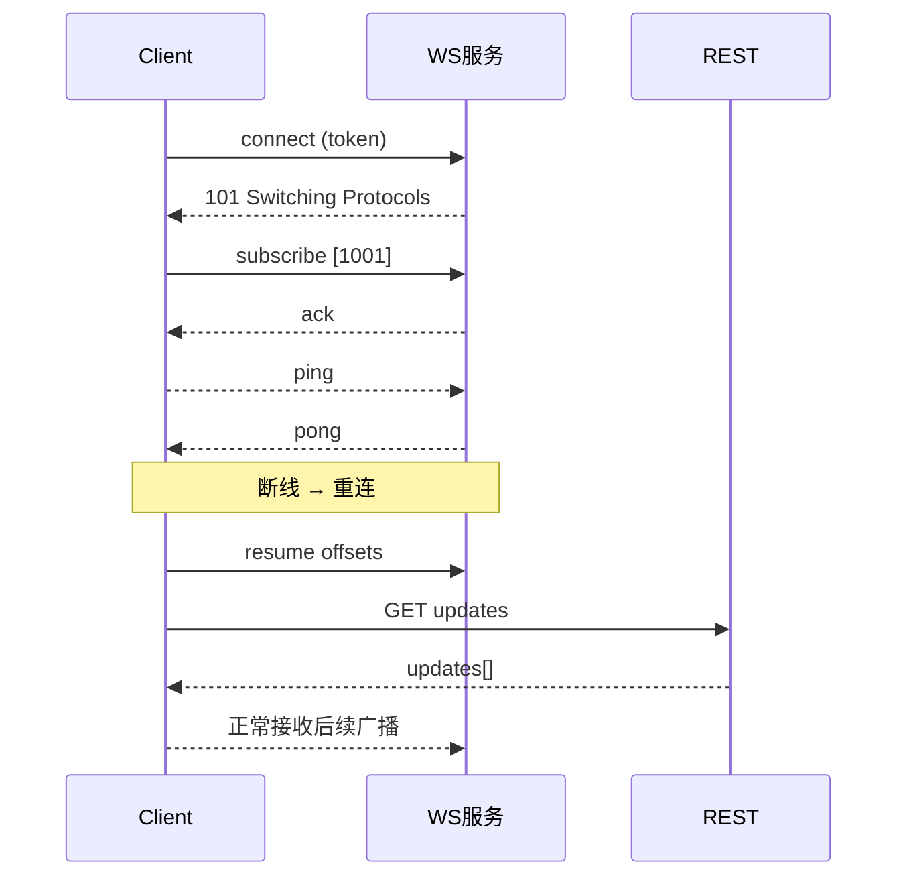

# KMarket 前端交互对接文档（微信小程序/H5）

> 基于 `docs/` 目录现有规范（JWT、WebSocket、Markets & Odds 等），梳理前端交互点与接口契约，提供触发条件、数据格式、成功/失败处理、依赖说明、错误码、示例代码、参数校验、性能与兼容性、单元测试要点、流程图与 Mock 数据。用于前后端联调与工程落地。

---

## 版本变更记录
- v1.0.0（2025-11-06）
  - 初版：整合 JWT 登录与会话、WebSocket 实时推送、市场/赔率 REST、管理端覆盖，补充弱网与重连、错误码、Mock 数据与测试要点

---

## 文档结构与模块
- 认证与会话（JWT）
- 市场与赔率（REST）
- 实时推送（WebSocket）
- 管理端操作（Admin）
- 健康与就绪（Health/Ready）
- 权限与角色（Permissions）
- 错误码与处理（Errors）
- 同步与防护（弱网/延迟/后台）
- 单元测试要点（Testing）
- 优先级与难度评估（Priorities）

---

## 认证与会话（JWT）

### 交互点：获取 nonce（前端发起签名挑战）
- 触发条件
  - 用户点击“登录”按钮，或进入需要鉴权的页面
- 请求
  - `GET /auth/nonce?address=<walletAddress>`
- 数据格式
  - 响应：`{ "nonce": "abcd1234", "expiresIn": 300 }`
- 成功处理
  - 构造消息 `"Login to KMarket: nonce=<nonce>"`，调用钱包 SDK personal_sign
- 失败处理
  - 网络失败→重试 3 次；服务端 5xx → 提示稍后再试
- 依赖
  - 钱包 SDK（EIP-191 personal_sign），后端 Redis（nonce 存储）
- 错误码
  - `BAD_REQUEST`（缺少地址或格式错误）、`SERVICE_UNAVAILABLE`

### 交互点：签名校验与颁发 JWT
- 触发条件
  - 完成消息签名后提交
- 请求
  - `POST /auth/verify-sig`
  - 体：`{ address, message, signature }`
- 数据格式
  - 成功：`{ token, expiresIn, user: { id, address, role } }`
- 成功处理
  - 将 `token` 缓存至 `wx.setStorageSync('token')`，后续请求统一带 `Authorization`
- 失败处理
  - `401 AUTH_FAILED` → 提示“签名校验失败”；`400 BAD_REQUEST` → 显示表单校验提示；`500 INTERNAL_ERROR` → 重试与反馈
- 依赖
  - `JWT_SECRET`、Postgres（用户）、Redis（会话）
- 错误码
  - `AUTH_FAILED`、`BAD_REQUEST`、`INTERNAL_ERROR`、`SERVICE_UNAVAILABLE`

### 交互点：获取当前用户信息
- 触发条件
  - 进入需要显示用户信息的页面
- 请求
  - `GET /auth/me`（需 Bearer）
- 数据格式
  - 响应：`{ id, address, role, last_login }`
- 成功处理
  - 缓存用户信息并渲染；若角色为 `admin`，展示管理入口
- 失败处理
  - `401` → 跳登录；`503` → 轻提示与重试
- 依赖
  - 中间件 JWT 校验、Redis 会话
- 错误码
  - `UNAUTHORIZED`、`SERVICE_UNAVAILABLE`

### 交互点：登出与撤销会话
- 触发条件
  - 用户触发“退出登录”
- 请求
  - `POST /auth/logout`（需 Bearer）
- 成功处理
  - 清空本地 token 与用户态，跳转到未登录页面
- 失败处理
  - `500` → 保守清理本地态并提示


### 参数校验规则
- `address`：以 `0x` 开头的 40 字节十六进制，大小写不敏感
- `signature`：以 `0x` 开头的 hex，长度校验（≥ 65 字节）
- `nonce`：仅一次性有效，TTL ≤ 5 分钟，消费后不可复用

### 性能指标
- `/auth/verify-sig`：P50 < 80ms；P95 < 150ms
- 中间件校验命中 Redis 会话：P95 < 15ms

### 兼容性
- 微信小程序需钱包 SDK 支持 EIP-191；H5 以 `window.ethereum.request({ method: 'personal_sign' })` 兼容

---

## 市场与赔率（REST）

### 交互点：获取市场列表
- 触发条件
  - 市场页加载或筛选条件变化
- 请求
  - `GET /markets?league=NBA&page=1&pageSize=20&sortBy=created_at&order=asc`
- 数据格式
  - 有数据库：`{ page, pageSize, total, items: [{ id, league, title, status, start_time, odds }] }`
  - 无数据库（开发模式）：`[ { id, name, active } ]`
- 成功处理
  - 渲染列表，缓存分页状态与筛选条件
- 失败处理
  - `503` → 降级为空态与重试按钮
- 依赖
  - Postgres、缓存（odds 聚合：缓存优先、DB 回退）
- 错误码
  - `BAD_REQUEST`、`SERVICE_UNAVAILABLE`

### 交互点：获取市场详情与赔率
- 触发条件
  - 进入详情页或切换市场
- 请求
  - `GET /markets/{id}` 或 `GET /odds/{market_id}`
- 数据格式
  - 旧：`{ odds_a, odds_b }`（bps）；新：`{ moneyline, spread, total, source }`
- 成功处理
  - 优先使用复合结构 `moneyline/spread/total`；未命中兼容旧字段
- 失败处理
  - `404` → 显示“未找到”；`503` → 重试或提示
- 依赖
  - 缓存键 `odds:{id}` 与 `oddsq:{id}`，TTL=60s
- 错误码
  - `NOT_FOUND`、`SERVICE_UNAVAILABLE`


### 参数校验规则
- `page/pageSize` 为正整数且 `pageSize ≤ 100`
- `league` 取值限定：`NBA|EPL|ALL`

### 性能指标
- 缓存命中：P95 < 100ms；DB 回退：P95 < 300ms；热门命中率 ≥ 92%

### 兼容性
- 小程序 `wx.request` 与 H5 `fetch` 行为一致；注意 JSON 序列化与时间戳单位（毫秒）

---

## 实时推送（WebSocket）

### 交互点：获取 WS 鉴权令牌
- 触发条件
  - 进入需要实时赔率的页面或订阅前
- 请求
  - `POST /api/ws/token`，体：`{ userId, scopeMarkets, ttlSeconds }`
- 数据格式
  - 响应：`{ token, expiresAt }`
- 成功处理
  - 将令牌拼接到 `wss://.../ws/odds?token=<JWT>`
- 失败处理
  - `401` → 重新登录；`403` → 检查 scope；`503` → 重试
- 依赖
  - JWT 中间件、Redis 会话
- 错误码
  - `UNAUTHORIZED`、`FORBIDDEN`、`SERVICE_UNAVAILABLE`

### 交互点：建立连接与订阅房间
- 触发条件
  - 页面加载后发起 `wx.connectSocket`，收到 `onSocketOpen`
- 请求
  - `GET /ws/odds?token=<JWT>`（Upgrade）；随后发送 `{ type: "subscribe", markets: ["1001","1002"] }`
- 数据格式
  - 出站 `ack/pong/odds_update/snapshot/error`
- 成功处理
  - `ack` 后开始渲染；严格按 `seq` 应用更新
- 失败处理
  - 弱网或断线→指数退避重连；乱序/丢序→触发 REST 补偿
- 依赖
  - Nginx Upgrade/TLS、Redis Pub/Sub 或内部总线
- 错误码
  - `INVALID_REQUEST`、`ROOM_NOT_FOUND`、`RATE_LIMITED`

### 交互点：心跳、断线重连与状态恢复
- 触发条件
  - `pong` 超时或连接异常
- 请求
  - 客户端每 15–30s 发送 `ping`；重连后发送 `{ type: "resume", offsets }`
- 数据格式
  - `offsets: { marketId: lastSeq }`
- 成功处理
  - 正常接收后续更新；缺失→调用 REST `updates` 或 `snapshot`
- 失败处理
  - `UNAUTHORIZED` → 重新获取 `/api/ws/token`


### 参数校验规则
- `markets` 为字符串数组，长度 ≤ 100；元素为数值字符串
- `offsets` 键为字符串 `marketId`，值为非负整数 `seq`

### 性能指标
- 端到端广播延迟 P95 ≤ 300ms；单实例并发连接 ≥ 10,000；吞吐 ≥ 1,000 msg/s

### 兼容性
- 微信小程序 `wx.connectSocket`；H5 使用 `WebSocket` 原生 API；生产需 `wss` 与反向代理 Upgrade 支持

### 流程图


---

## 管理端操作（Admin）

### 交互点：创建/更新市场
- 触发条件
  - 管理页面提交表单
- 请求
  - `POST /admin/markets`、`PUT /admin/markets/{id}`（需 `Authorization: Bearer <ADMIN_TOKEN>`）
- 数据格式
  - 创建体：`{ league, home_team, away_team, start_time }`
- 成功处理
  - 返回新 `market_id`；刷新列表并广播相关变更（如需）
- 失败处理
  - `403 FORBIDDEN` → 角色不足；`400` → 表单提示；`500` → 日志与告警
- 依赖
  - 角色校验、审计日志（`admin_actions`）

### 交互点：赔率覆盖
- 触发条件
  - 管理员提交覆盖表单
- 请求
  - `POST /admin/odds/override`
- 数据格式
  - 见文档示例（`moneyline/spread/total`）
- 成功处理
  - 写审计与缓存写穿；通过 WS 广播 `odds_update`
- 失败处理
  - `403`、`400`、`500` 按语义提示与重试

---

## 健康与就绪（Health/Ready）

### 交互点：健康检查与监控展示
- 触发条件
  - 前端状态页或调试工具发起检查
- 请求
  - `GET /readyz`、`GET /healthz`、`GET /api/ws/health`
- 数据格式
  - `readyz`: 关键依赖可用性；`healthz`: 200 固定；`ws/health`: `{ connections, topics, messages_sent }`
- 成功处理
  - 将指标渲染为状态卡片，异常时给出运维提示

---

## 权限与角色（Permissions）
- 登录用户默认 `roles = ["user"]`；管理操作需 `admin`
- WS 鉴权令牌携带 `scopeMarkets`，前端订阅范围应受控；越权订阅返回 `FORBIDDEN`

---

## 错误码与处理（Errors）
- 统一结构：`{ code: string, message: string }`
- 常见错误码
  - `BAD_REQUEST`：参数错误
  - `UNAUTHORIZED`：未认证/令牌无效
  - `FORBIDDEN`：权限不足
  - `NOT_FOUND`：资源不存在
  - `SERVICE_UNAVAILABLE`：依赖不可用
  - `INTERNAL_ERROR`：服务器错误
  - `RATE_LIMITED`：被限流
  - `ROOM_NOT_FOUND`：订阅房间不存在
- 前端处理策略
  - 4xx 显示语义化提示并引导纠正；5xx 提供重试与状态页

---

## 同步与防护（弱网/延迟/后台）
- 弱网（50–500ms）
  - 降低订阅数量与消息频率；严格按 `seq` 应用；断档走 REST 补偿
- 后台挂起恢复
  - 小程序 `onShow` 时立即重连并发送 `resume`，对比 `seq/ts` 触发快照替换
- 断线重连
  - 指数退避策略（500ms 起，最大 5s）；成功后先 `resume` 再接收增量
- 乱序与丢序防护
  - 按 `marketId` 维护本地 `lastSeq`；发现乱序则拉取 `updates` 或直接 `snapshot`

---

## 单元测试要点（Testing）
- JWT
  - `nonce` 一次性消费、签名校验成功/失败分支、Redis 会话 TTL 对齐
- REST 市场与赔率
  - 分页与筛选、旧字段兼容、缓存命中与 DB 回退、错误码语义
- WebSocket
  - 订阅/取消订阅、心跳与超时、断线重连 `resume`、乱序/丢序补偿、Scope 越权校验
- 弱网与后台
  - 模拟 50–500ms 延迟、后台挂起与恢复、消息乱序注入与一致性自检

---

## 关键接口 Mock 数据
- `/auth/nonce`
```json
{ "nonce": "abcd1234", "expiresIn": 300 }
```
- `/auth/verify-sig`
```json
{ "token": "<jwt>", "expiresIn": 604800, "user": { "id": 1, "address": "0x...", "role": "user" } }
```
- `/auth/me`
```json
{ "id": 1, "address": "0x...", "role": "user", "last_login": 1730875800000 }
```
- `/markets`
```json
{ "page":1, "pageSize":20, "total":2, "items":[{ "id":1001, "league":"NBA", "title":"Lakers vs Warriors", "status":"OPEN", "start_time":1730908800000, "odds":{ "moneyline":{ "home":1.85, "away":2.10 } } }] }
```
- `/odds/{market_id}`（新结构）
```json
{ "moneyline": { "home": 1.85, "away": 2.10 }, "spread": { "line": -3.0, "home": 1.92, "away": 1.88 }, "total": { "line": 219.5, "over": 1.90, "under": 1.90 }, "source": "cache" }
```
- `/api/ws/token`
```json
{ "token": "<jwt>", "expiresAt": 1730908800000 }
```
- `WS odds_update`
```json
{ "type":"odds_update", "marketId":1001, "seq":1025, "ts":1710001113000, "payload":{ "moneyline":{ "home":1.85, "away":2.10 } } }
```
- `REST snapshot`
```json
{ "marketId":1001, "seq":0, "ts":1710001113000, "payload":{ "moneyline":{ "home":1.85, "away":2.10 } } }
```
- `REST updates`
```json
{ "marketId":1001, "fromSeq":1000, "toSeq":1025, "updates":[ { "type":"odds_update", "marketId":1001, "seq":1001, "ts":1710001100000, "payload":{ "moneyline":{ "home":1.84, "away":2.12 } } } ] }
```

---

## 优先级与难度评估
- P0（高优先级，难度中）
  - JWT 登录与会话、REST 市场列表与赔率、WS 连接/订阅/心跳/重连/补偿
- P1（中优先级，难度中高）
  - 管理端覆盖与审计、弱网与后台恢复策略、错误码统一与用户友好提示
- P2（低优先级，难度低中）
  - 健康状态页与监控接入、H5 兼容提示与降级方案

---

## 参考与来源
- `docs/JWT_USE.markdown`、`docs/BACKEND_JWT.md`
- `docs/WEBSOCKET_USE.md`、`docs/BACKEND_WEBSOCKET.md`
- `docs/MARKET&ODD_USE.md`、`docs/BACKEND_MARKETSVC&ODDSVC.md`