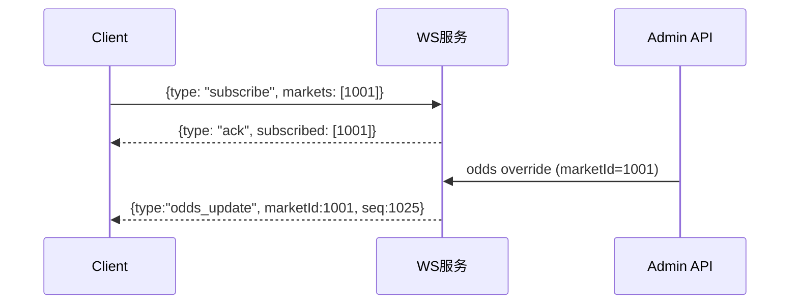
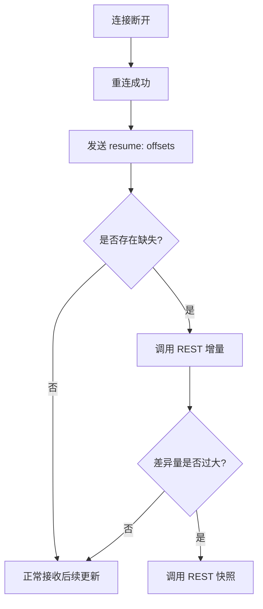
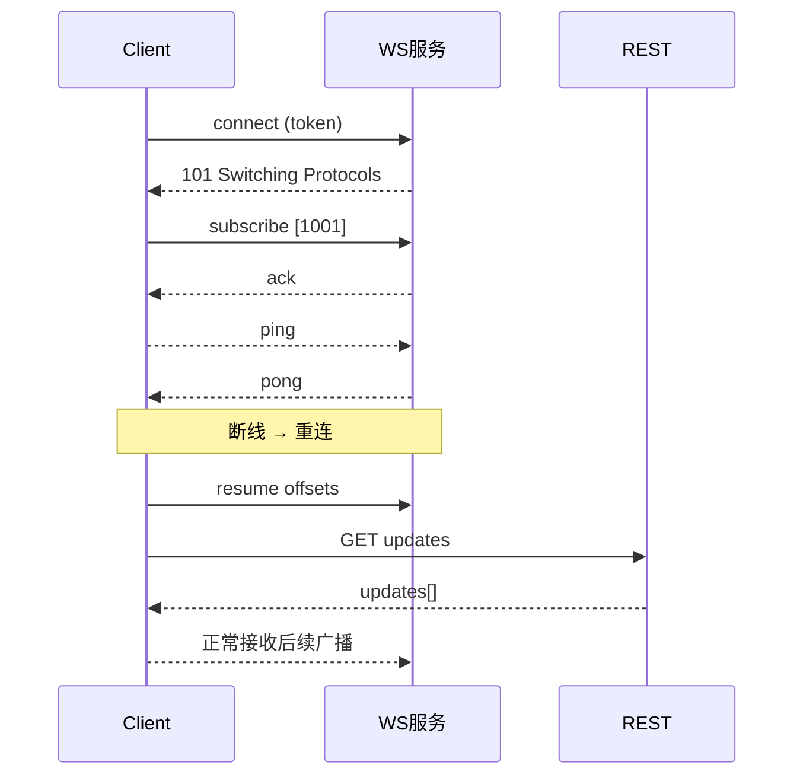

# WebSocket 使用教程（KMarket 后端）

> 本教程面向微信小程序与网页客户端，指导如何使用 KMarket 后端提供的 WebSocket 实时推送服务与配套 REST 接口。内容涵盖连接、订阅、心跳与断线重连、弱网适配、监控与调试等实践。

## 1. 快速开始
- 前置条件
  - 后端启动：`cargo run`（默认监听 `http://127.0.0.1:8080`）
  - 环境变量：建议配置 `JWT_SECRET`、`REDIS_URL`、`DATABASE_URL`（可选）
  - 反向代理（生产）：Nginx 支持 WebSocket Upgrade 与 TLS（见下文）
- 获取短期 JWT（用于 WebSocket 鉴权）
  - `POST /api/ws/token`
  - 请求示例：
    ```json
    { "userId": 1, "scopeMarkets": [1001,1002], "ttlSeconds": 600 }
    ```
  - 响应：
    ```json
    { "token": "<jwt>", "expiresAt": 1730908800000 }
    ```
- 建立连接（微信小程序）
  - 使用 `wx.connectSocket`：
    ```js
    const token = "<从 /api/ws/token 获取>";
    const wsUrl = `wss://api.example.com/ws/odds?token=${encodeURIComponent(token)}`;

    const socket = wx.connectSocket({ url: wsUrl });

    wx.onSocketOpen(() => {
      console.log("WS open");
      // 订阅 marketId 列表
      wx.sendSocketMessage({ data: JSON.stringify({ type: "subscribe", markets: ["1001","1002"] }) });
    });

    wx.onSocketMessage((evt) => {
      const msg = JSON.parse(evt.data);
      // 处理 ack / odds_update / pong / snapshot 等
      console.log("WS message", msg);
    });

    wx.onSocketClose(() => { console.warn("WS closed"); });
    wx.onSocketError((err) => { console.error("WS error", err); });
    ```

## 2. 消息协议
- 入站（客户端 → 服务端）
  - 订阅：
    ```json
    { "type": "subscribe", "markets": ["1001","1002"] }
    ```
  - 取消订阅：
    ```json
    { "type": "unsubscribe", "markets": ["1002"] }
    ```
  - 重连恢复（带偏移）：
    ```json
    { "type": "resume", "offsets": { "1001": 1024, "1002": 88 } }
    ```
  - 心跳：
    ```json
    { "type": "ping", "ts": 1710001112223 }
    ```
- 出站（服务端 → 客户端）
  - Ack：
    ```json
    { "type": "ack", "ok": true, "subscribed": [1001] }
    ```
  - Pong：
    ```json
    { "type": "pong", "ts": 1710001112223 }
    ```
  - 广播更新（moneyline 示例）：
    ```json
    {
      "type": "odds_update",
      "marketId": 1001,
      "seq": 1025,
      "ts": 1710001113000,
      "payload": { "moneyline": { "home": 1.85, "away": 2.10 } }
    }
    ```
  - 快照（在 REST 中获取，更可靠）：
    ```json
    {
      "type": "snapshot",
      "marketId": 1001,
      "seq": 0,
      "ts": 1710001113000,
      "payload": { "moneyline": { "home": 1.85, "away": 2.10 } }
    }
    ```

## 3. 订阅与广播
- 订阅房间：通过 `subscribe` 指定 `marketId` 列表，服务端返回 `ack` 并开始推送该房间的更新。
- 有序性：同一 `marketId` 内广播携带单调递增 `seq` 与时间戳 `ts`；客户端应按 `seq` 严格应用更新。
- 慢消费者：客户端处理耗时过长时，建议触发快照重同步，避免积压导致延迟扩大。
- 管理端更新：调用 `/admin/odds/override` 后端会写审计与缓存，并通过 WS 广播 `odds_update` 给订阅者。



## 4. 心跳与断线重连
- 心跳
  - 服务端会每 15s 发送 `ping` 或期望收到客户端 `ping`；心跳超时（默认 60s）将关闭连接。
  - 小程序端建议每 15–30s 定时发送 `ping` 并记录 `pong` 时间差。
- 断线重连策略（指数退避）
  ```js
  let reconnectAttempt = 0;
  function scheduleReconnect() {
    const base = 500; // 500ms
    const delay = Math.min(5000, base * Math.pow(2, reconnectAttempt));
    reconnectAttempt++;
    setTimeout(connectWs, delay);
  }
  ```
- 状态恢复（resume）
  - 客户端缓存每个 `marketId` 的最近 `seq`：`offsets = {"1001": lastSeq, ...}`
  - 重连成功后立即发送：
    ```js
    wx.sendSocketMessage({ data: JSON.stringify({ type: "resume", offsets }) });
    ```
  - 若 `resume` 仍存在缺失，调用 REST 增量或快照接口进行补偿。



## 5. REST 辅助接口
- 发放 WS 鉴权令牌
  - `POST /api/ws/token`
  - 请求：`{"userId":1,"scopeMarkets":[1001,1002],"ttlSeconds":600}`
- 快照
  - `GET /api/markets/{marketId}/odds/snapshot`
  - 响应：`{"marketId":1001,"seq":0,"ts":...,"payload":{...}}`
- 增量更新
  - `GET /api/markets/{marketId}/odds/updates?since_seq=1000&limit=200`
  - 响应：`{"marketId":1001,"fromSeq":1000,"toSeq":1025,"updates":[...]}`
- 健康检查
  - `GET /api/ws/health`
  - 响应：`{"connections":0,"topics":3,"messages_sent":128}`
- Curl 示例（Windows PowerShell）
  ```powershell
  # 获取 token
  curl -Method POST -Uri http://127.0.0.1:8080/api/ws/token -Body '{"userId":1}' -ContentType 'application/json'

  # 快照
  curl http://127.0.0.1:8080/api/markets/1001/odds/snapshot

  # 增量
  curl http://127.0.0.1:8080/api/markets/1001/odds/updates?since_seq=0&limit=50

  # 健康
  curl http://127.0.0.1:8080/api/ws/health
  ```

## 6. 弱网适配与一致性
- 弱网（50–500ms）下建议策略：
  - 降低消息频率（按需订阅，避免过量 marketId）
  - 严格按 `seq` 应用；发现断档即触发 REST 补偿
  - 设置心跳间隔 15–30s；无 `pong` 立即重连
- 一致性检测
  - 前端渲染时对比 `seq/ts` 与本地状态；偏差过大触发快照替换
  - 显示与底层数据不同步时优先快照再回放增量，确保状态一致

## 7. 反向代理（Nginx）
```nginx
server {
  listen 443 ssl;
  server_name api.example.com;

  ssl_certificate     /etc/ssl/fullchain.pem;
  ssl_certificate_key /etc/ssl/privkey.pem;

  location /ws/odds {
    proxy_http_version 1.1;
    proxy_set_header Upgrade $http_upgrade;
    proxy_set_header Connection "upgrade";
    proxy_set_header Host $host;
    proxy_read_timeout 600s;
    proxy_pass http://backend:8080;
  }
}
```

## 8. 前端封装示例（微信小程序）
```js
class OddsWSClient {
  constructor(baseUrl, token) {
    this.baseUrl = baseUrl; this.token = token;
    this.offsets = {}; this.socketOpen = false; this.timer = null;
  }
  connect() {
    const url = `${this.baseUrl}/ws/odds?token=${encodeURIComponent(this.token)}`;
    wx.connectSocket({ url });
    wx.onSocketOpen(() => { this.socketOpen = true; this._startHeartbeat(); this.resume(); });
    wx.onSocketMessage((evt) => this._onMessage(JSON.parse(evt.data)));
    wx.onSocketClose(() => { this.socketOpen = false; this._stopHeartbeat(); this._scheduleReconnect(); });
    wx.onSocketError(() => { this.socketOpen = false; this._stopHeartbeat(); this._scheduleReconnect(); });
  }
  subscribe(marketIds) {
    if (!this.socketOpen) return;
    wx.sendSocketMessage({ data: JSON.stringify({ type: "subscribe", markets: marketIds.map(String) }) });
  }
  resume() {
    if (!this.socketOpen) return;
    wx.sendSocketMessage({ data: JSON.stringify({ type: "resume", offsets: this.offsets }) });
  }
  _onMessage(msg) {
    if (msg.type === "odds_update") {
      const mid = String(msg.marketId);
      const seq = msg.seq || 0;
      const last = this.offsets[mid] || 0;
      if (seq === last + 1) {
        this.offsets[mid] = seq; // 正常顺序
        this._applyUpdate(msg);
      } else if (seq > last + 1) {
        this._fetchDelta(mid, last); // 断档，拉增量
      } /* seq <= last 忽略重复或乱序 */
    } else if (msg.type === "pong") {
      // 可记录心跳延迟
    } else if (msg.type === "ack") {
      // 订阅/恢复确认
    }
  }
  _applyUpdate(msg) {
    // TODO: 应用到 UI 或状态管理
  }
  _fetchDelta(marketId, fromSeq) {
    const url = `${this.baseUrl}/api/markets/${marketId}/odds/updates?since_seq=${fromSeq}&limit=200`;
    wx.request({ url, success: ({ data }) => {
      (data.updates || []).forEach((u) => this._applyUpdate(u));
      this.offsets[String(marketId)] = data.toSeq || fromSeq;
    } });
  }
  _startHeartbeat() { this.timer = setInterval(() => {
    if (this.socketOpen) wx.sendSocketMessage({ data: JSON.stringify({ type: "ping", ts: Date.now() }) });
  }, 15000); }
  _stopHeartbeat() { if (this.timer) { clearInterval(this.timer); this.timer = null; } }
  _scheduleReconnect() { setTimeout(() => this.connect(), 1000); }
}
```

## 9. 调试与监控
- 日志：后端使用 `tracing` 输出结构化日志，可通过 `RUST_LOG=info` 查看连接与广播状况。
- 健康：调用 `GET /api/ws/health` 监控连接与消息累计数。
- 常见错误
  - `UNAUTHORIZED`：`token` 无效或过期 → 重新获取 `/api/ws/token`
  - `SERVICE_UNAVAILABLE`：后端未初始化 WS Hub 或 Redis → 检查配置与重启
  - 乱序/丢序：按 `seq` 检测到断档 → 调用 REST 增量或快照

## 10. 端到端测试与联调
- 本地测试
  - 编译与测试：`cargo test -q`
  - 运行后端：`cargo run`
- 快速联调
  - 获取 token → 小程序连接 → `subscribe` → 管理端 `odds/override` → 观察 `odds_update`
- 压力与弱网模拟
  - 调整订阅量与心跳间隔；刻意断网重连；验证 `resume` 与 REST 补偿的可靠性



---

**关键提示**
- 使用 `wss` 与 Nginx 反向代理，确保心跳与超时设置合理。
- 同一 `marketId` 内严格按 `seq` 应用；断档时走 REST 的 `updates/snapshot`。
- 弱网与后台挂起下的重连需立即发送 `resume` 并补偿增量，保障前端状态与后端一致。