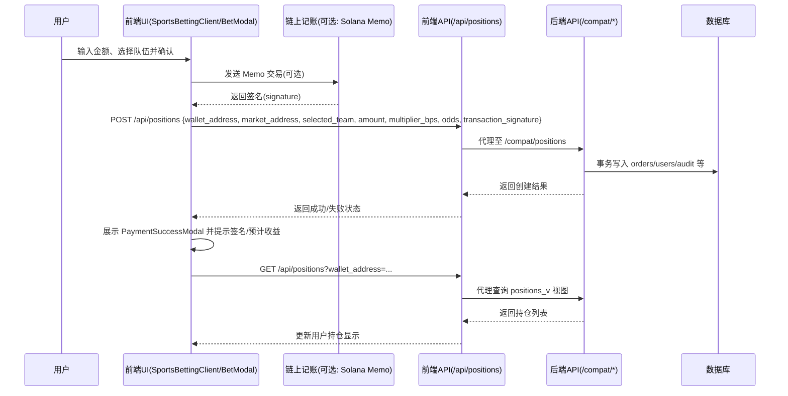

# 支付与持仓流程安全审查报告（KM 项目）

> 文档位置：`docs/payment_review.md`
> 审查范围：前端（Next.js App Router + 组件）、中间层（前端 `/api/*` 代理）、后端（Actix + SQLx）、与链上记账（Solana Memo）相关的支付/持仓逻辑。

## 系统架构图

```mermaid
flowchart LR
  subgraph Client[前端客户端]
    A[UI: BetModal / SportsBettingClient]
    B[Hook: useSportsBetting]
    C[apiClient(fetch 封装)]
    D[页面: MyBet / Positions]
    E[UI: ConfirmBetModal / PaymentSuccessModal]
  end

  subgraph FrontendAPI[前端 API 代理层 (Next.js /api/*)]
    F1[/api/positions (POST/GET/PATCH)]
    F2[/api/positions/close (POST)]
    F3[/api/bets (GET->redirect)]
    F4[/api/wallet-ledger (GET/POST)]
  end

  subgraph Backend[后端服务 (Actix /api/v1 & /compat)]
    G1[/compat/positions (POST 开仓)]
    G2[/compat/users/{address}/positions (GET 持仓)]
    G3[/compat/positions/close (POST 平仓)]
    G4[/api/v1/admin/* (管理路由)]
  end

  subgraph DB[(PostgreSQL)]
    H1[(orders)]
    H2[(users)]
    H3[(markets)]
    H4[(audit_logs)]
    H5[(positions_v 视图)]
  end

  subgraph Chain[链上]
    I[(Solana RPC)]
    J[Memo 程序]
  end

  A -- 交互/下注 --> E
  A -- 读写本地状态 --> B
  E -- 确认下注 --> A
  A -- 使用 --> C

  C -- POST/GET/PATCH 请求 --> F1
  C -- POST --> F2
  C -- GET --> F3
  C -- GET/POST --> F4

  F1 -- 代理 --> G1 & G2
  F2 -- 代理 --> G3
  F4 -- 读取/校验签名 --> I
  A -- (可选) 发送 Memo --> J --> I

  G1 & G3 -- 事务写入 --> DB
  G2 -- 查询视图 --> H5
```

## 支付流程时序图



## 关键代码片段（收敛）

- 前端下注确认与开仓请求：`components/sports/SportsBettingClient.tsx`

```ts
// onConfirm 片段（简化展示）
const { apiClient } = await import('@/lib/apiClient');
const json = await apiClient.post('/api/positions', {
  wallet_address: walletAddr,
  fixture_id: fixtureNumeric,
  market_address: marketAddress,
  selected_team: selectedTeamNum,
  amount: matchData.wager.amount,
  multiplier_bps: Math.round(matchData.wager.multiplier * 10000),
  odds_home_bps: Math.round(matchData.odds.home * 10000),
  odds_away_bps: Math.round(matchData.odds.away * 10000),
  transaction_signature: signature,
}, { timeoutMs: 10000 });
```

- 前端 API 代理层：`app/api/positions/route.ts`

```ts
// POST 归一化与代理（片段）
const resp = await fetch(`${base}/compat/positions`, {
  method: 'POST',
  headers: { 'content-type': 'application/json' },
  body: JSON.stringify(normalized),
});
```

- 请求封装：`lib/apiClient.ts`

```ts
export const apiClient = {
  post: (path, body, opts) => request('POST', path, { ...(opts ?? {}), body }),
  // 超时默认 10s；写请求自动附加 JSON 头；可选 Authorization
};
```

- 前端链上记账代理：`app/api/wallet-ledger/route.ts`

```ts
// POST 验证签名存在并快速返回（~2.5s 超时）
const tx = await Promise.race([
  conn.getTransaction(data.signature, { maxSupportedTransactionVersion: 0 }),
  new Promise((r) => setTimeout(() => r(null), 2500)),
]);
```

- 后端兼容开仓：`kmarket-backend/src/routes/compat.rs`

```rs
// create_frontend_position 主要校验与市场解析（片段）
if req.wallet_address.trim().is_empty() || req.amount <= 0.0 || (req.selected_team != 1 && req.selected_team != 2) {
  return Ok(HttpResponse::BadRequest().json(ApiResponse::<()>::error("INVALID_ARGS", "Missing or invalid fields")));
}
// 解析 fixture_id / market_address / 'market_<id>' 三路映射
```

- 后端平仓与事务：`kmarket-backend/src/repository/order_repo.rs`

```rs
// cancel_with_close_fields（片段）
let mut tx = self.db_pool.begin().await?;
let rec = sqlx::query_as::<_, Order>("UPDATE orders SET status='cancelled', ... RETURNING ...")
  .bind(close_price).bind(close_pnl).bind(id).bind(expected_version)
  .fetch_optional(&mut *tx).await?;
sqlx::query("INSERT INTO order_audits ...").bind(rec.order_id).execute(&mut *tx).await?;
tx.commit().await?;
```

## 审查发现（问题清单）

### 1) 前端支付流程检查
- 表单验证不足：`BetModal` 仅判定 `parseFloat(betAmount) > 0`，未做精度、最小/最大额度、余额校验、风控限制。
- 请求参数构造分散：体育模块用 `SportsBettingClient.tsx`；市场模块 `BetModal` 仍未打通到 `/api/positions`（见 `FRONTEND_MARKETS_ORDERS.md`），存在逻辑不统一。
- 错误处理较弱：失败时多为 `console.error` 或 `alert`，无统一错误码映射与用户友好提示；未区分网络超时、后端校验失败等类型。
- 状态展示分裂：`PaymentSuccessModal` 展示成功，但与后续列表刷新/确认状态并非强绑定；`useSportsBetting` 本地 `bets` 与服务器持仓未同步。
- 交互流程遗漏：未校验钱包连接、未检查余额或授权额度；链上记账为可选且不与后端事务强耦合。

### 2) 后端支付处理检查
- 请求验证基本充分：`compat::create_frontend_position` 检查钱包地址、金额、队伍选择；但未校验链上签名与余额占用（仅存储逻辑，无实际清算）。
- 支付网关缺失：当前无真实支付网关/托管方案；“支付”更接近于记录下注持仓，账务清算未与链上或第三方支付集成。
- 支付结果处理：平仓 `cancel_with_close_fields` 使用简化 PnL 公式，未根据业务赔率/方向完整计算；未做复核与再入账。
- 数据库事务管理：订单取消/结算具备事务与审计日志写入；开仓路径以兼容路由为主、对审计记录还可增强。
- 异常处理机制：统一 `ApiResponse` 返回，错误时包含 code/message；部分 SQLx 错误映射较为通用，建议细化错误码。
- 日志完整性：Actix 统一 tracing；但下注/平仓的业务审计未完全覆盖（管理员路由已覆盖 audit_logs）。

### 3) 前后端交互检查
- API 契约一致性：前端字段与后端 DTO 基本对齐（`positions_v`、`FrontendPosition`）；体育下注使用 `selected_team=1/2` 与 `*_bps` 对齐；市场模块的 `BetModal` 尚未对齐。
- 传输加密：本地默认 `http://localhost:8080`；生产应强制 HTTPS。前端 `apiClient` 未强制 https 校验；需通过部署与配置保证 TLS（WAF/负载均衡）。
- 状态同步机制：`EventListener` 负责从链上事件写入后端，但 `wallet-ledger` 未落库；`confirmation_status` 字段默认 `pending`，缺少签名确认写入与状态提升。
- 超时策略：`apiClient` 默认 10s；链上签名校验 2.5s；前端 API 代理 fetch 无 `AbortController`，建议与 `apiClient` 保持一致。

## 改进建议（优先级）

- 高优先级：
  - 统一下注入口：将 `BetModal` 接入 `/api/positions`，复用 `SportsBettingClient` 的参数构造与校验逻辑。
  - 强化前端表单校验：额度上限/最小值、精度限制、钱包余额/授权校验、风险提示与复核弹窗。
  - 引入幂等性与防重：在前后端下注接口支持 `idempotency_key`，避免重复提交。
  - 支付/签名状态落库：新增表（如 `wallet_ledger`）或扩展 `positions`，记录 `transaction_signature`、`block_slot`，异步确认提升 `confirmation_status`。
  - 统一错误码与提示：建立错误码字典，将后端 `ApiResponse.error(code)` 映射到前端用户友好提示。

- 中优先级：
  - 完善 PnL 与结算逻辑：按赔率/方向计算真实盈亏；平仓事务中更新用户汇总字段（`users.total_pnl` 已具备）。
  - 日志与审计扩展：对下注/平仓的所有动作记录 audit 日志，并附带请求体摘要与 actor 标识。
  - API 代理层超时与取消：将 `/api/*` 代理使用 `apiClient` 封装，统一超时/取消与调试日志。

- 低优先级：
  - 接入 EVM/多链兼容：`lib/web3.ts` 为占位；后续真实支付网关或托管方案设计时再整合。
  - 安全加固：CSRF 防护、Rate Limit、WAF 规则、重放保护（签名+时间戳+nonce）。

## 风险点评估

- 无真实支付清算：目前“支付”仅为持仓记录；缺少资金托管与清算，存在资金风险与合规风险。
- 链上签名与持仓未强绑定：签名未落库，难以审计与复盘；需引入签名确认与不可抵赖性。
- 表单与交互校验不足：可能导致异常输入或越权下注；应强制钱包连接与健康校验。
- 事务与一致性：开/平仓路径需统一审计；失败重试与幂等机制需完善，避免双写或遗漏。
- 传输安全：生产环境需强制 HTTPS 与鉴权；避免明文传输导致数据泄露。

## 参考与附录

- 重要文件：
  - 前端下注：`components/sports/SportsBettingClient.tsx`、`components/market/BetModal.tsx`
  - 状态与组件：`hooks/useSportsBetting.ts`、`components/sports/ConfirmBetModal.tsx`、`components/ui/PaymentSuccessModal.tsx`
  - 前端 API：`app/api/positions/route.ts`、`app/api/positions/close/route.ts`、`app/api/bets/route.ts`、`app/api/wallet-ledger/route.ts`
  - 请求封装：`lib/apiClient.ts`
  - 后端路由：`kmarket-backend/src/main.rs`（`/api/v1`、`/compat`）、`kmarket-backend/src/routes/compat.rs`
  - 仓库与事务：`kmarket-backend/src/repository/order_repo.rs`
  - 视图与映射：`kmarket-backend/src/state.rs`（`positions_v`）、`kmarket-backend/src/utils/mappers.rs`、`kmarket-backend/src/models/dto.rs`

- 配置建议：
  - `NEXT_PUBLIC_API_BASE_URL` 指向生产后端 HTTPS 域名（含 `/api/v1`）
  - `NEXT_PUBLIC_API_TOKEN` 如需鉴权，前端自动附带 `Authorization: Bearer`
  - `NEXT_PUBLIC_SOLANA_RPC_URL` 指向可靠 RPC；在 `wallet-ledger` 持久化签名与 slot

---

以上为当前版本的全面审查结论与建议。如需我继续落地改造（统一下注入口、引入幂等与签名落库、错误码与提示统一），请告知优先级，我可以直接提交相应改动并提供测试脚本。