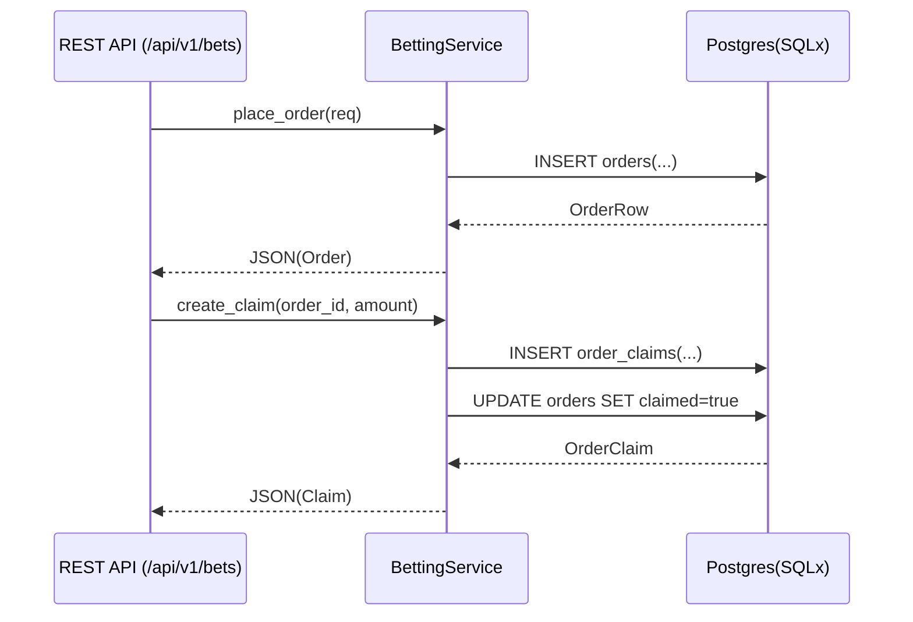

# BettingService 接口文档

本服务层封装下注/订单查询/领取的核心业务逻辑，统一对接 PostgreSQL（SQLx）。

## 模块位置
- 源码路径：`src/services/betting.rs`
- 导出入口：`src/services/mod.rs`

## 数据模型
- 订单行类型：`crate::models::order::OrderRow`
- 领取记录：`crate::models::order_claim::OrderClaim`

## 接口定义
```rust
#[async_trait]
pub trait BettingService {
    async fn place_order(&self, req: PlaceOrder) -> Result<OrderRow>;
    async fn get_order_by_id(&self, order_id: i64) -> Result<Option<OrderRow>>;
    async fn list_orders(&self, q: ListOrdersQuery) -> Result<Vec<OrderRow>>;
    async fn mark_claimed(&self, order_id: i64) -> Result<()>;
    async fn create_claim(
        &self,
        order_id: i64,
        claim_amount_text: &str,
        claimer_address: &str,
        claim_tx_hash: Option<&str>,
        status: &str,
    ) -> Result<OrderClaim>;
}
```

### 入参结构
```rust
pub struct PlaceOrder {
    pub order_id: i64,
    pub user_address: String,
    pub market_id: i64,
    pub amount_text: String,
    pub odds: i32,
    pub option: i16,
    pub potential_payout_text: Option<String>,
    pub tx_hash: Option<String>,
}

pub struct ListOrdersQuery {
    pub user_address: Option<String>,
    pub market_id: Option<i64>,
    pub settled: Option<bool>,
    pub page: i64,
    pub page_size: i64,
}
```

## 实现
- `PgBettingService`：基于 SQLx/Postgres 的实现，直接调用 `db::repo::*`。

## 使用示例
```rust
let svc = PgBettingService::new(pg_pool.clone());
let row = svc.place_order(PlaceOrder {
    order_id: chrono::Utc::now().timestamp_millis(),
    user_address: "0xabc".into(),
    market_id: 1001,
    amount_text: "1000".into(),
    odds: 185,
    option: 1,
    potential_payout_text: None,
    tx_hash: Some("0x...".into()),
}).await?;
```

## 约束与校验建议
- 在路由层进行基础校验（金额格式与范围、赔率范围），服务层保持“写库即失败”的语义，由数据库约束保证一致性。
- 建议在后续迁移中将 `orders.user_address` 替换为 `user_id` 外键。

## 交互流程（Mermaid）
